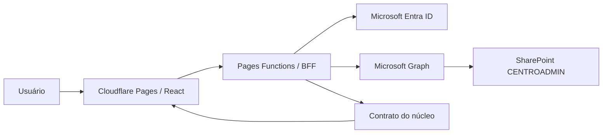

# ARCHITECTURE — Ecossistema Escolar / Centro de Administração

## Contexto

O repositório já possui a fundação institucional em produção. O Centro de Administração é construído como parte nativa dessa fundação, sem substituir Cloudflare Pages/Functions, Microsoft Entra ID, BFF, Microsoft Graph, SharePoint `CENTROADMIN`, grupos, sessão, CI/CD ou rotação automática de certificados.

Nível do sistema: `production-system`.

A candidata v0.2 é um rollout de validação controlada: código implantável na infraestrutura oficial, porém acessível funcionalmente apenas ao papel `ADMINISTRADOR`. Não equivale a liberação oficial.

## Escolhas principais

- frontend: React + TypeScript + Vite já existentes;
- backend: Cloudflare Pages Functions/BFF existente;
- persistência autoritativa do núcleo: SharePoint `CENTROADMIN` para os registros institucionais já provisionados;
- autenticação: Microsoft Entra ID pelo fluxo BFF já implantado;
- autorização: sessão selada HttpOnly + papel resolvido por grupos; endpoints administrativos exigem `ADMINISTRADOR` no servidor;
- deploy: GitHub Actions → Cloudflare Pages, mantendo `main` como branch de produção técnica;
- UI: `professional-default`, `comfortable + layered + balanced`;
- design system: CSS/HTML nativos sobre a base existente nesta fatia; não foi introduzida biblioteca visual nova apenas por estética;
- Motion Profile: `ambient` na entrada; atenuado para `subtle` nas telas administrativas densas;
- reduced motion: obrigatório e implementado por `prefers-reduced-motion`;
- testes: Vitest + lint + typecheck + build + actionlint + zizmor no CI existente;
- semantic depth: `domain`;
- Independent Verification: `independent` para esta candidata, usando CI existente e revisão de diff/contratos; gates adicionais destrutivos permanecem fora de produção.

## Componentes

## Fluxo de dados da candidata v0.2

1. O navegador consulta `/api/me` para recuperar somente a identidade de sessão necessária à interface.
2. Usuário sem sessão vê a experiência de login e continua pelo endpoint `/auth/login` existente.
3. Usuário autenticado sem `ADMINISTRADOR` não entra no shell de validação.
4. `ADMINISTRADOR` consulta uma única composição `/api/platform/snapshot`.
5. O BFF valida sessão e papel antes de consultar dados.
6. O backend lista o schema já existente no SharePoint e lê, em paralelo, somente os campos necessários de `PLATAFORMA_MODULOS`, `PLATAFORMA_CONFIGURACOES`, `PLATAFORMA_AUDITORIA` e `PLATAFORMA_MIGRACOES`.
7. Valores de configuração (`ValorJson`), IDs de usuário e detalhes arbitrários da auditoria não são enviados ao navegador nesta candidata.
8. A interface apresenta estados de loading, sucesso, vazio e erro com correlation ID quando disponível.

## Fontes de verdade

- identidade e autenticação: Microsoft Entra ID;
- autorização institucional: grupos existentes → papel de sessão resolvido pelo BFF;
- sessão: cookie HttpOnly selado pelo BFF;
- dados do núcleo administrativo: SharePoint `CENTROADMIN` nas listas já provisionadas;
- módulos nativos do shell: `server/platform/manifest.ts` como manifesto versionado em código;
- contrato compartilhado navegador/BFF: `shared/platform-contract.ts`;
- infraestrutura e CI/CD: GitHub `main` e documentação operacional vigente.

O manifesto nativo não substitui `PLATAFORMA_MODULOS`: o primeiro descreve áreas permanentes do núcleo; a lista registra módulos/sistemas incorporados ou administráveis pela plataforma.

## Limites e contratos

### Navegação

A candidata usa rotas hash (`#/visao-geral`, `#/sistemas`, etc.) para que destinos sejam endereçáveis/restauráveis sem alterar o catch-all do BFF nem criar fallback novo no Cloudflare nesta fase.

### Permissões

- todos os endpoints da candidata são somente leitura;
- `/api/platform/snapshot` exige sessão válida e papel `ADMINISTRADOR` no servidor;
- esconder navegação não é usado como controle de acesso;
- Publicações e Páginas aparecem como áreas planejadas, sem endpoint de escrita e sem mutação real.

### Dados retornados ao cliente

O snapshot pode retornar:

- manifesto dos módulos nativos;
- módulos registrados e seus metadados não secretos;
- chaves/escopo/versão/vigência de configurações, sem valores;
- eventos recentes de auditoria sem identificador do usuário e sem `DetalhesJson`;
- migrations registradas;
- estado da fundação e contagem de listas.

## Semantic Assurance

- semantic contract: `specs/semantic-contract.json`;
- semantic assurance: `specs/semantic-assurance.json`;
- vocabulário relevante: candidata, núcleo, módulo nativo, módulo registrado, capacidade, snapshot, liberação oficial;
- restrição central: código implantado para validação não é liberação oficial;
- autorização: acesso administrativo deve ser confirmado no servidor;
- escrita: proibida nesta candidata para os domínios de produto ainda não construídos;
- formalizações: não aplicável nesta fatia; não há ganho proporcional em solver/model checker para a superfície somente leitura atual.

## API / integração

Modo: `lightweight`.

O endpoint `/api/platform/snapshot` é uma interface interna do BFF para um único frontend, sem consumidor externo ou necessidade atual de OpenAPI. O contrato TypeScript compartilhado é suficiente para esta fatia. Se novos consumidores independentes surgirem, o modo deve ser reavaliado para `contract`.

## Segurança

- nenhuma credencial nova foi criada;
- nenhum secret foi adicionado ao Git;
- fluxo Entra/BFF não foi reimplementado;
- `Sites.Selected` existente continua delimitando o Graph ao site autorizado;
- autorização administrativa é server-side;
- respostas `/api/*` permanecem `no-store` e recebem os headers de segurança existentes;
- Graph continua com timeout/retry já implementados;
- dados retornados foram minimizados por finalidade.

## UI profissional

Inventário da candidata:

- app shell;
- page header;
- stats;
- navegação;
- data lists;
- tabela de auditoria;
- loading;
- empty;
- error/retry;
- permission denied;
- login.

A tela de login usa movimento ambiente de baixa amplitude porque possui espaço visual e baixa densidade. O shell administrativo evita loops decorativos e usa apenas microinterações. Em mobile, a sidebar vira navegação horizontal e grades viram uma coluna.

## Observabilidade

- correlation ID permanece no tratamento global do BFF;
- o snapshot possui correlation ID próprio para consulta institucional;
- falhas 5xx continuam registradas pelo mecanismo existente;
- a UI exibe correlation ID em erro quando recebido, sem expor stack ou detalhes sensíveis.

## Recuperação e rollout

- baseline seguro antes do Centro: `8d28f1d35384a12a7028e25e0ec2a126edfdfdab`;
- candidata v0.1: `d2fe89b2315e5cc2def634aa91f871f8f4290c15`;
- desenvolvimento v0.2 ocorre em `test/centro-admin-v0.2` e PR próprio;
- merge em `main` só ocorre após CI e revisão da candidata;
- mesmo após implantação em `admin.escolaieda.com`, a candidata continua restrita a `ADMINISTRADOR`;
- liberação oficial continua condicionada à frase exata `APROVADO PARA PRODUÇÃO`;
- rollback técnico usa o histórico Git/Cloudflare já existente, sem migração destrutiva nesta fatia.

## Decisões substituídas

A v0.1 carregava o estado da fundação por um health check separado e mostrava módulos como cartões locais. A v0.2 substitui esse caminho por um único snapshot composto no BFF e por um manifesto versionado. Não existem dois caminhos ativos para a mesma responsabilidade.
