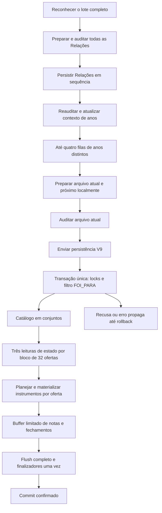

# Importação V11: integridade e desempenho (#1225)

Fonte de verdade: [issue #1225](https://github.com/mcpmieda/ecossistema-escola/issues/1225), anexos A–F, contratos V9 e decisões canônicas do Banco. Este documento registra implementação e evidência; não redefine regras acadêmicas.

## Escopo do release

F1–F6 compõem o release de código, sem alteração de transporte, schema, migrations, privilégios, provider ou política de publicação. O líder retirou expressamente **F7 deste release**: escopo individual da preparação do Portal depende de medição produtiva adequada e contrato próprio aprovado. O conjunto conservador de alunos, mudanças globais e finalizadores vigentes continua sendo utilizado. F7 não está concluída.

A correção F1 tem PR separado. Os commits de F2, F5, F3/F4 e F6 permanecem identificáveis por fase; a integração coordenada das otimizações está na PR [#1227](https://github.com/mcpmieda/ecossistema-escola/pull/1227). Essa organização reduz estados intermediários e concentra a verificação completa sobre a composição final. Instrumentos e limites do buffer são publicados juntos.

## Fluxo implementado



Nenhuma Auditoria nem persistência acadêmica do próximo arquivo é antecipada. Dentro de cada fila de ano existe no máximo uma operação remota ativa. A concorrência local não substitui os locks do servidor nem protege outras abas. Todas as Relações passam pela barreira global antes de qualquer docente.

## Responsabilidades e limites

- `import-relational-service-v10.ts`: recusa tipada atravessa o limite transacional externo; resposta original é devolvida após rollback. Exceções inesperadas continuam sendo propagadas.
- `relational-import-read-set-v11.ts`: resolução de catálogo usando normalização SQL `lower(btrim(...))`, associação por identidade/sourceIndex, três leituras de instrumentos/notas/fechamentos por bloco. Inclui todas as observações persistidas, inclusive nulas e de alunos fora do trecho enviado.
- `import-relational-instrument-plan-v11.ts`: plano por oferta reutiliza os helpers decisórios V9. `relational-import-instrument-batch-v11.ts` materializa retiradas filho→pai, criações e alterações antes das notas; valida contagens e todas as chaves retornadas.
- `json-record-chunks-v1.ts`: helper comum F4/F5. Cada registro JSON é serializado uma vez; cada grupo é montado a partir dos registros, com contabilidade UTF-8 incluindo colchetes e vírgulas.
- `relational-import-write-buffer-v11.ts`: grupo SQL de até **512 registros / 256 KiB**; pendências somadas entre as sete categorias de até **2.048 registros / 1 MiB JSON**. Ordem: exclusão/alteração/criação de nota; histórico/exclusão/alteração/criação de fechamento. Dependência sobre a mesma chave força flush prévio. Falha invalida a instância; não há repetição de grupos parcialmente executados. Uma nova tentativa exige nova transação.
- `use-import-batch.ts`: até **4 filas de anos**, com **atual + próximo** por fila, máximo **8 estruturas docentes preparadas**. Esse limite não conta os resultados reconhecidos mantidos para a interface. Todas as Relações são preparadas para a barreira global, limitadas pelo lote já aceito; sua quantidade é medida separadamente e liberada conforme termina.

Os limites são internos, não novos limites de arquivo/população. Um pedido válido maior percorre vários blocos/grupos sob a mesma transação. O teto JSON pendente não representa limite de heap: requests, readsets, diagnósticos da interface e strings têm custo adicional.

Compatibilidade: quando o trim de apresentação JavaScript e o `btrim` SQL diferem nas bordas (por exemplo TAB/NBSP), todas as disciplinas do pedido seguem o resolvedor V9 em ordem original. Isso conserva inclusive as recusas já existentes na reimportação desse transporte; o produtor do navegador já envia os rótulos sem essas bordas. Ofertas e estado continuam agrupados. Testes executados também na fonte baseline verificam a primeira aceitação, a recusa repetida e a ordem entre rótulos mistos. Esse caminho excepcional não redefine normalização ou identidade.

Grafias SQL equivalentes com rótulos diferentes de disciplina usam o resolvedor sequencial vigente quando necessário; preserve-se a ordem e contagem de mudanças globais. Se a mesma oferta SQL aparece em posições diferentes, os mapas são atualizados em sequência. Instrumentos são agrupados **por oferta**, não integralmente por bloco. Leituras legítimas de ledger e fronteiras de metadados ainda podem descarregar o buffer.

## Métricas e fronteiras

O observador é criado por requisição autorizada, abaixo do buffer. Ele preserva receiver, transações aninhadas, `lastFailure` e fechamento do adaptador. Só registra agregados e categorias fixas: não retém parâmetros, resultados, SQL bruto, nomes, identificadores individuais, hashes de arquivos ou valores acadêmicos.

| Medida                                                                                             | Fronteira / interpretação                                                                                                                                                                                                                                                                           |
| -------------------------------------------------------------------------------------------------- | --------------------------------------------------------------------------------------------------------------------------------------------------------------------------------------------------------------------------------------------------------------------------------------------------- |
| `handlerMs`, header `X-Gradebook-Server-Ms`                                                        | Handler autorizado, preservando significado anterior; não inclui necessariamente encerramento do adaptador.                                                                                                                                                                                         |
| `requestLifecycleMs`                                                                               | Entrada da rota até conclusão do wrapper, incluindo encerramento do recurso.                                                                                                                                                                                                                        |
| `transactionMs`, `transactionOutcome`                                                              | Transação externa; `rejected` não certifica fisicamente rollback e `unknown` distingue falha após callback completo. Testes reais certificam rollback.                                                                                                                                              |
| `sqlCalls`, `sqlReadCalls`, `sqlWriteCalls`, `sqlFailedCalls`, `rowsRead`                          | Chamadas físicas, abaixo do buffer; uma delegação `query`→`executeNative` não é contada duas vezes.                                                                                                                                                                                                 |
| `coordinationCallMs`, `finalizerMs`                                                                | Tempo das chamadas de coordenação; tempo completo dos callbacks finalizadores. Não representam exclusivamente espera de lock ou CPU de SQL.                                                                                                                                                         |
| `readSetBlocks`, `readSetOffers`, `maximumReadSetOffers`, `maximumReadSetRows`                     | Blocos executados, ofertas carregadas e maior soma de linhas dos três conjuntos do bloco. Não medem bytes do heap.                                                                                                                                                                                  |
| `catalogReadCalls`, `catalogWriteCalls`, `instrumentsCreated/Updated/Retired`                      | Catálogo e instrumentos identificados por marcadores SQL fixos; contagens físicas de linhas.                                                                                                                                                                                                        |
| `groupedStatements*`, `groupCounts`, `maximumGroupRows/Bytes`                                      | Grupos de notas/fechamentos tentados, concluídos ou falhos; tamanho real emitido. Grupos de instrumentos têm medidas separadas.                                                                                                                                                                     |
| `bufferedLogicalMutations`, `flushesWithWork`, `flushReasonCounts`, `maximumPendingRows/JsonBytes` | Entradas lógicas e descargas efetivas. Razões: leitura, write não bufferizado, fim de transação, dependência, linhas ou bytes. Flush vazio não é contado.                                                                                                                                           |
| Browser `diagnosticLocalMs`, `canonicalBuildMs`, `auditRequestMs`, `preparationElapsedMs`          | Preparação local, construção canônica e HTTP de Auditoria separados. `version: 2` e `totalMs` anteriores preservam o recorte preparação + Auditoria; `preparationElapsedMs` inclui retenção/espera até o fim da Auditoria. A fase de Auditoria distingue observação inicial e follow-up da Relação. |
| Browser `queueWaitMs`, `persistRequestMs`, `payloadBytes`                                          | Fila após preparação, excluindo Auditoria; fetch até leitura/validação da resposta; bytes UTF-8 do corpo enviado. Ausência de header é `null`, não zero.                                                                                                                                            |
| Browser `firstPersistenceStartedMs`, `firstConfirmedPersistenceMs`, `batchElapsedMs`               | Primeiro POST efetivamente despachado, primeira confirmação aplicada/idêntica e lote completo. Recusa/erro incerto não conta como confirmação.                                                                                                                                                      |
| Browser `maximumPreparedTeacherItems/Relations`, `maximumActiveYearLanes`                          | Picos de estruturas canônicas locais e filas ativas; não estimam heap total ou throughput sustentado.                                                                                                                                                                                               |

Falha de logging opcional não altera a resposta acadêmica. As métricas permanecem agregadas também em recusas; status, tempo e contador não identificam aluno.

## Evidência de desempenho

Ambiente descartável: Node 24.19.0, PGlite 0.5.8, mesma sessão cloud, migrations existentes de gradebook e fixtures existentes do Portal (incluindo revisão/outbox). São 15 ofertas, 30 vínculos inventados, 4 instrumentos × 3 trimestres e 360 notas observadas, incluindo nulos. Três repetições com banco novo para cada sequência; nenhuma conexão nem carga artificial sobre produção.

Comparação reproduzível: fonte baseline `fe985de6c95936408cd9d8b0b2065241abfc109d` em checkout isolado, copiando apenas o teste de medição; fonte backend candidata `cbe3269b` com o mesmo teste, antes das mudanças de fila (que não participam desse ensaio servidor). São versões de fonte identificáveis, não evidência de CI/publicação. Os hashes de fatos e contagens de referência também coincidiram com a baseline inicial medida em `a7cd3868` mais árvore F2, posteriormente commitada em `fe985de6`.

Cada cenário preservou o mesmo digest dos fatos sintéticos (notas, instrumentos, fechamentos e contadores de revisão), em todas as três repetições, e o mesmo resumo lógico de writes. A igualdade não ignora nulos/zeros nem contadores; apenas metadados técnicos de geração não entram na seleção. O teste reproduzível protege esses resultados de referência.

| Cenário                              | SQL antes → depois | Leituras antes → depois | Flushes antes → depois | Mediana ms antes → depois (n=3) | Máximo grupo notas/fechamento, registros / bytes depois | Fatos e resumo iguais? |
| ------------------------------------ | ------------------ | ----------------------- | ---------------------- | ------------------------------- | ------------------------------------------------------- | ---------------------- |
| Primeira carga / 15 ofertas          | 495 → 81           | 80 → 10                 | 195 → 16               | 283.61 → 107.8                  | 24 / 1201                                               | Sim                    |
| Reimportação idêntica / 15 ofertas   | 86 → 16            | 80 → 10                 | 0 → 0                  | 39.66 → 14.12                   | 0 / 0                                                   | Sim                    |
| Uma nota alterada                    | 88 → 18            | 80 → 10                 | 1 → 1                  | 50.22 → 23.22                   | 1 / 48                                                  | Sim                    |
| Um metadado alterado                 | 88 → 18            | 80 → 10                 | 0 → 0                  | 53.51 → 25                      | 0 / 0                                                   | Sim                    |
| Qualitativo indisponível             | 86 → 16            | 80 → 10                 | 0 → 0                  | 37.92 → 15.38                   | 0 / 0                                                   | Sim                    |
| Retirada autoritativa de qualitativo | 93 → 19            | 80 → 10                 | 0 → 0                  | 50.19 → 24.97                   | 0 / 0                                                   | Sim                    |

Tempo individual antes/depois, por cenário e repetição:

- `M01-first-15-offers`: [305.61, 260, 283.61] → [128.38, 107.8, 101.39] ms.
- `M02-identical-15-offers`: [44.66, 39.66, 38.05] → [17.51, 14.12, 13.43] ms.
- `M03-one-mark`: [50.22, 45.62, 50.84] → [23.68, 23.22, 21.23] ms.
- `M04-instrument-metadata`: [53.51, 46.53, 55.56] → [25.58, 25, 23.79] ms.
- `M05-unavailable-preserves`: [37.92, 36.81, 39.7] → [15.38, 13.44, 15.48] ms.
- `M05-authoritative-remove`: [53.13, 49.97, 50.19] → [27.66, 23.12, 24.97] ms.

Na primeira carga, grupos de notas/fechamentos caíram de 210 para 45, writes SQL de 409 para 65 e flushes de 195 para 16. Uma nota ou um metadado alterado continua contando um write lógico; retirada de três instrumentos com seis notas conta nove linhas, embora execute menos statements. Reimportação idêntica e origem indisponível permanecem sem DML/revisão extra.

A redução estrutural é demonstrada; a mediana da primeira carga sintética caiu aproximadamente 62%. Com n=3, não se calcula p95 nem se promete SLA, ganho Hyperdrive ou capacidade produtiva. PGlite/WASM e aquecimento do runner não representam latência de rede/Cloudflare/PostgreSQL remoto. O custo de preparação do Portal real continua sem medição suficiente para autorizar F7.

Fila: comparação determinística `fe985de6` → candidata, 18 docentes do mesmo ano, n=1 por versão, custos injetados iguais de 3ms local/80ms Auditoria/5ms persistência: primeiro POST **1.494 → 83ms**, primeira confirmação **1.499 → 88ms**, lote **1.584 → 1.584ms**, pico preparado **18 → 2**, 18 confirmações na mesma ordem. O lote sequencial do mesmo ano conserva seu custo remoto; o primeiro arquivo não aguarda toda a preparação/Auditoria. Esses números são relógio de teste controlado, não latência observada de navegador/rede. O caso `reports a comparable 18-file...` em `bounded-import-queue.test.ts` reproduz a experiência.

Testes de promises controladas/fake timers também demonstram o primeiro POST sem aguardar todos os docentes, quatro anos ativos, uma operação remota por ano e máximo oito estruturas preparadas. Isso comprova sobreposição e limites, sem alegar mediana produtiva de lote.

## Verificação e operação

```sh
npx vitest run tests/gradebook/import/relational-import-atomicity-v11.test.ts tests/gradebook/import/relational-import-read-set-v11.test.ts tests/gradebook/import/relational-import-instrument-plan-v11.test.ts tests/gradebook/import/relational-import-write-buffer-v11.test.ts tests/gradebook/import/import-performance-observer-v1.test.ts tests/gradebook/import/bounded-import-queue.test.ts tests/gradebook/import/import-diagnostics-current-state-v1.test.ts
BENCHMARK_REPETITIONS_V11=3 BENCHMARK_REPORT_PATH_V11=/tmp/import-performance-v11.json npx vitest run tests/gradebook/import/relational-import-performance-v11.test.ts
npm run verify
npm run test:student-portal-postgres
```

Para a comparação histórica, copiar somente o mesmo teste para o checkout `fe985de6` e executar com `BENCHMARK_PROFILE_V11=baseline`; esse perfil mantém os seis asserts semânticos e de idempotência, apenas omite os limites estruturais próprios da implementação nova. Nenhum tempo absoluto é gate de aceitação. A execução comum do CI exercita todos os cenários em uma repetição.

PostgreSQL nativo exige o ambiente descartável e configurações vigentes das suítes; não se utiliza produção. A prova nativa F1 compara tabelas gradebook/Portal após recusas, incluindo writes físicos anteriores. PGlite adicional comprova recusa lógica, SQL23505 real/injetado, cardinalidade, falha inesperada, segundo chunk e finalizador; novos testes de conjuntos cobrem 33 ofertas, retorno invertido, observações nulas fora do trecho, REC N/C/R/R e idempotência.

O primeiro CI F1 encontrou mock V9 sem retorno e outro com estado legado inexistente `persisted` em `misc-native-reads-v1.test.ts`. A fixture passou a devolver `no-changes` e o teste verifica a mesma resposta; nenhuma regra de produção nem gate foi relaxado. Uma execução nativa oscilou no p95 de login (1.589ms para limite1.500ms, fora da importação alterada); reexecução do mesmo head passou sem mudar teste ou limite.

Diagnóstico prático: comparar SQL/flushes/tamanho com `transactionMs`, `handlerMs`, lifecycle e HTTP. Muito tempo de lifecycle após handler pede investigação de encerramento, sem alterar pool nesta entrega. Erro de rede/503 da persistência significa confirmação incerta: parar novos despachos, drenar os já iniciados e retomar só pendentes na mesma aba. Recibos confirmados permanecem confirmados mesmo quando uma re-Auditoria falha. Auditoria tem resultado independente, incluindo observação vazia `[]`; uma gravação acadêmica não limpa diagnósticos por conta própria.

Uso real posterior: responsável escolhe lote/momento. Conferir confirmação, resumo/Auditoria, reimportação idêntica e resultado do Portal. Comparar os agregados disponíveis sem copiar arquivos, valores ou IDs para repositório público. Monitor existente cobre saúde/telemetria parcial; não certifica importações autenticadas nem banco profundo.

Reversão: interromper novos despachos se houver regressão, preservar recibos/estado incerto e usar PR + gates + deploy oficial para corrigir/reverter as otimizações. **Manter a proteção F1**; voltar ao rollback vulnerável não é estado final aceitável. Nenhuma migration foi criada/aplicada, nenhuma reconstrução ou reset produtivo faz parte dessa reversão.

## Prestação de contas F0–F9 (atualizada em 02/10/2026 após publicação)

| Fase | Estado neste checkpoint              | Evidência / pendência                                                                                                                                                                                                                                                                                 |
| ---- | ------------------------------------ | ----------------------------------------------------------------------------------------------------------------------------------------------------------------------------------------------------------------------------------------------------------------------------------------------------- |
| F0   | Concluída                            | Baseline main `5faaab56`, AGENTS, contratos e anexos A–F revalidados.                                                                                                                                                                                                                                 |
| F1   | Integrada e publicada                | PR #1226 integrada em `443e6f2c`; CI `36959363295` e nativo `36959362896` aprovados no head `0867a76f`; deploy oficial `36960364498` concluído, incluindo monitor pós-publicação.                                                                                                                     |
| F2   | Implementada                         | Commit `fe985de6`; observer e fronteiras de tempo, baseline válida e privacidade testada.                                                                                                                                                                                                             |
| F3   | Implementada                         | Commit `ed7fa55d`; catálogo em conjuntos e três leituras por bloco32.                                                                                                                                                                                                                                 |
| F4   | Implementada                         | Mesmo commit; plano com helpersV9 e materialização limitada por oferta.                                                                                                                                                                                                                               |
| F5   | Implementada                         | Commit `a10545c4`; limites globais, chunks, dependências e instância inválida após falha.                                                                                                                                                                                                             |
| F6   | Implementada e revisada              | Commit `2037d910`; fila, barreiras, lookahead e retomada; recibo confirmado preservado na re-Auditoria403 e follow-up sem novo POST acadêmico.                                                                                                                                                        |
| F7   | Retirada expressamente deste release | Condicional; contrato/aprovação e medição próprios pendentes. Não implementada.                                                                                                                                                                                                                       |
| F8   | Gates técnicos concluídos            | Head F1–F6 `c3e427f03ca99154f01a847fe0edf1d2d5c76b89`: CI `36962192058`, nativo `36962191648` e Sonar aprovados. O checkpoint de publicação registra 3.822 testes principais aprovados e três skips preexistentes. As medições históricas acima são preservadas, sem homologação produtiva implícita. |
| F9   | Integrada e publicada                | PR #1227 integrada em `34284c43889aa122e465907340a106974cc6e981`; deploy oficial `36963202863` e monitor concluídos com sucesso. Evidência: [checkpoint F1–F6](https://github.com/mcpmieda/ecossistema-escola/issues/1225#issuecomment-5945451048). Uso real continua separado.                       |

Não confundir código implementado, gates aprovados, publicação concluída e uso real homologado. A issue permanece aberta enquanto a prestação de contas final não estiver registrada.

## Pós-F6 — Adendo G: relatório essencial limitado

Fonte: [Adendo G](https://github.com/mcpmieda/ecossistema-escola/issues/1225#issuecomment-5950289691).
Baseline revalidada `main@34284c43`, sem PR concorrente aberta no início. F1–F6 não foram refeitas;
F7 continua não implementada. Este patch não altera parser, transporte V9, regras acadêmicas,
Auditoria, filas, concorrência, SQL, migrations, infraestrutura, cache do loader ou timeouts.

**Defeito reproduzido:** fixture de 18 docentes no hook e clique no botão real recebia apenas
50 linhas finais, começando no índice legado 5, com `batch-complete` mas sem `recognition-batch`
ou reconhecimento inicial. G0 está no commit `2f0cf2ae`; o teste falhou pelo corte, não por SLA/API nova.

`import-timing-report-v1.ts` preserva cabeçalho, biblioteca/reconhecimento, registros por posição
original e resumo final independentemente da cauda. Retém **inicial + última retomada**, cada qual
com **até 50 posições / 50 eventos recentes**. As retomadas intermediárias omitidas são contadas;
novo lote substitui ambos. Cada execução tem início/fim/contadores próprios. Retomada não reconhece
novamente: `recognitionStatus: not-performed` e tempos nulos, com indicação da disponibilidade inicial.
O mapa privado usa IDs de `batch.files` em ordem de seleção, inclusive posições de falhas; exportação
contém somente `sourceFileIndex`, `runOrdinal`, `runKind` e enums/contagens/tempos permitidos.
`index` legado de persistência permanece ordem de execução, podendo diferir da posição original.

Os registros essenciais incluem preparação local mesmo se a Auditoria parar por autorização,
observação inicial/follow-up separados, espera na fila, despacho real, serialização/bytes/HTTP
e resultado/handler. Não retêm File, bytes do arquivo, workbook, manifest, request/response, nomes,
hashes, IDs acadêmicos, valores ou mensagens livres. Sentinelas inteiramente inventadas testam
exportação e Console. Diagnóstico vive em memória, sem armazenamento persistente ou endpoint novo.

**Como copiar:** use **Copiar diagnóstico**, disponível também durante a execução e após falha
de biblioteca/zero reconhecidos. O clique cria um snapshot JSON legível; não reconstrói o relatório
da cauda. Sucesso aparece somente após o Clipboard confirmar. Se o Clipboard estiver ausente,
lançar ou rejeitar, o mesmo snapshot fica em campo somente leitura para seleção/cópia manual.
Fechar/recarregar a tela apaga o histórico; iniciar outro lote o substitui. A cópia não pausa nem
reenvia operações. Eventos descartados e retomadas omitidas aparecem no painel e no JSON.

`status` é `in-progress`, `paused` ou `finished`, separado de `final.outcome` e da cobertura.
`finished` pode descrever falha; `completed` legado indica término do scheduler, sem garantir todas
as notas aplicadas. `confirmedRequests` conta recibos `applied/no-changes`. Cada estágio não medido
é `null`; zero continua zero medido. Cobertura informa denominadores por etapa e falhas do observador.
Cauda descartada não invalida os essenciais. Um coletor/logger com falha produz diagnóstico parcial
ou indisponível, sem autoridade sobre confirmação, bloqueio ou retomada. Após unmount, referências
diagnósticas são limpas; callbacks de geração antiga não escrevem no lote seguinte.

| Campo                                            | Fronteira e limite de interpretação                                                                                                      |
| ------------------------------------------------ | ---------------------------------------------------------------------------------------------------------------------------------------- |
| `sheetJsWaitMs`                                  | Await de `loadSheetJs` nesta execução; espera restante observada, sem afirmar download/cache/CPU.                                        |
| `recognitionCallMs`                              | Await de `importWorkbookBatch`, excluindo biblioteca; em retorno excepcional mede até rejeição.                                          |
| `recognitionFinishedAtMs`                        | Offset do retorno do reconhecimento desde início do lote; null se não retornou.                                                          |
| `postRecognitionToFirstDispatchMs`               | Primeiro despacho acadêmico menos offset do retorno, somente na mesma execução. Null na retomada.                                        |
| `recognition-batch.totalMs`                      | Legado: elapsed desde início, incluindo espera de biblioteca.                                                                            |
| `fileReadMs`, `manifestMs`, `yieldMs`            | Leitura de bytes; construção de manifesto incluindo SHA; devolução de controle, respectivamente. Manifesto não mede exclusivamente hash. |
| `recognitionMs`, `workbookReadMs`, `xlsxReadMs`  | Durações inclusivas sobrepostas; não somar pai e filho.                                                                                  |
| `masterRelationRecognitionMs`                    | Chamada única já existente ao reconhecedor de Relação, inclusive quando não há Relação reconhecida.                                      |
| `recognizeWorkbookMs`, `canonicalRostersMs`      | Legado inclui preservação das dimensões; passagem retirada continua zero quando medido, sem recriá-la.                                   |
| `canonical-local` / `localPreparationMs`         | Preparação exclusivamente local, preservada antes de esperar Auditoria.                                                                  |
| `canonical-file.totalMs`, `preparationElapsedMs` | Legados: local + Auditoria; elapsed incluindo retenção/espera. Nenhum significa CPU.                                                     |
| `persistence-dispatch` / `queueWaitMs`           | Fronteira legada na entrada do cliente, antes da serialização; preservada como registro de fila.                                         |
| `academic-dispatch`, `firstPersistenceStartedMs` | Callback `onDispatch` existente, imediatamente antes do fetch real. Não é preparo/clique/Auditoria.                                      |
| `auditRequestMs`, `persistRequestMs`, `serverMs` | Fronteiras existentes. HTTP menos handler não é upload; pode conter rede/wrapper/validação/overhead.                                     |

**Análise G4 e próxima coleta:** se reconhecimento dominar, examinar bytes/manifesto/yield/parser
e os índices caros. Se biblioteca dominar, investigar sua disponibilidade observada. Se o intervalo
posterior ao reconhecimento dominar, examinar preparo/Auditoria/barreira e trechos não detalhados.
Se persistências aplicadas dominarem, usar handler/lifecycle/transação/SQL/coordenação/flush/finalizadores
já existentes, explicitando qualquer acesso autorizado que falte. `finalizerMs` não mede exclusivamente
Portal; não autoriza F7. Não somar filas simultâneas/espera de lookahead à duração de parede, não
atribuir resíduo automaticamente a CPU/GC e não preencher lacunas com zero. Toda média deve informar
`n` e cobertura; sem p95/SLA/ganho antes/depois em amostra única ou incompatível.

### Observação real parcial recebida em 02/10/2026

Dados do responsável transcritos no Adendo G, **não medidos por estes testes**. SHA servido ao
navegador não foi demonstrado pelo recorte. Lote de 18 arquivos: `batchElapsedMs=52393.8`, primeiro
despacho `29690.9` (56,67% do lote), primeira confirmação `33428.3`; intervalo despacho→confirmação
`3737.4`, despacho→fim `22702.9` ms. Confirmados/processados `18/18`, pico preparado docente `2`,
Relações preparadas `0`, filas anuais `1`. Isso não certifica cada fato acadêmico nem explica os
**29.690,9 ms iniciais**.

| index legado | Estado     | HTTP ms | handler ms |
| -----------: | ---------- | ------: | ---------: |
|            8 | no-changes |   240,6 |        163 |
|            9 | applied    | 1.472,8 |      1.425 |
|           10 | applied    | 2.120,9 |      2.079 |
|           11 | no-changes |   209,7 |        148 |
|           12 | applied    | 1.964,2 |      1.918 |
|           13 | no-changes |   244,6 |        145 |
|           14 | no-changes |   192,7 |        140 |
|           15 | no-changes |   202,5 |        140 |
|           16 | no-changes |   225,0 |        145 |
|           17 | no-changes |   232,2 |        151 |

Somente **10/18 persistências**: sete idênticas, médias HTTP/handler `221,04/147,43` ms;
três aplicadas `1.852,63/1.807,33` ms. Soma handler/HTTP nesses três `97,55%`, sem localizar
SQL ou Portal isoladamente. Dez preparações locais: média `15,99`, faixa `3,7–27,6` ms;
nove Auditorias explícitas `recorded`: média `172,38`, faixa `150,1–210,4` ms; primeira ausente
no recorte. Serialização `0–0,4` ms, pedidos `12.966–68.894` bytes, sem indicar tamanho XLSB.
Uma espera de fila `2194.5` ms coexistiu com HTTP `209.7`/handler `148`; não somar à operação
anterior como intervalos independentes. Não há baseline produtiva anterior equivalente.

**Única coleta real pendente do responsável:** escolher horário/arquivos de lote legítimo,
copiar o relatório completo com versão de publicação verificável e condições conhecidas de
cache/ambiente; observar os mesmos arquivos idênticos quando apropriado e uma alteração legítima
quando existir. Conferir Banco/Portal pelo fluxo normal sem publicar conteúdo individual. Não
resetar banco, criar ano/dado fictício, reimportar Relação antiga ou alterar nota para medir.
Essa pendência não bloqueia implementação/testes/entrega da correção de observabilidade.

### Regressões e entrega técnica G5–G6

| Matriz G | Evidência sintética                                                                                                                                    |
| -------- | ------------------------------------------------------------------------------------------------------------------------------------------------------ |
| T01–04   | Hook e Clipboard real após 18/50 posições; coletor com mais de 500 eventos, início/fim preservados.                                                    |
| T05–06   | Botão real: Clipboard ausente/rejeitado/síncrono, status, cópia manual e snapshot em andamento.                                                        |
| T07–08   | Relações depois de docentes na seleção; follow-up distinto; quatro anos respondendo fora de ordem, fila/limites iguais.                                |
| T09–11   | Auth em Auditoria/persistência e confirmação incerta; somente pendentes; quatro retomadas, inicial + última. Clientes de auth existentes reexecutados. |
| T12–13   | Novo lote e callbacks tardios; unmount com await de persistência/Clipboard.                                                                            |
| T14–16   | Biblioteca/formato/leitura/hash/parser/zero reconhecidos; erro original preservado; observadores/logger/coletor falhos; relógio determinístico.        |
| T17–19   | Sentinelas privadas sintéticas; mesmo request/estado/ordem/chamadas com logger falho; reconhecimento com/sem observador equivalente.                   |
| T20      | Status acadêmico, cobertura, nulls e descartes independentes.                                                                                          |

Testes: `bounded-import-queue.test.ts`, `import-timing-report-v1.test.ts`,
`import-timing-copy-v1.test.tsx`, `synthetic-import-batch.test.ts`, `auth-resume-v1.test.ts`.
86 testes direcionados aprovados no checkpoint G1–G3 `e81ed345`; ajustes posteriores e gates
do head final constam nos checkpoints/PR da #1225. `npm run lint`, `npm run typecheck` e
`npm run verify` continuam gates; nenhum limite/assert foi removido para aprovar.

### Custo local da observabilidade G6

Mesma fixture do hook, baseline real `34284c43` e candidata: Windows, Node 24.16.0,
Vitest 4.1.11/jsdom, uma amostra registrada por cenário/versão. As cópias temporárias de
baseline foram removidas. Os testes verificam corpos canônicos iguais e estado `no-changes`.

| Arquivos | Bytes exportados antes → depois | Serializações de eventos antes → depois | Construção/exportação antes → depois (ms) | Renders antes → depois | Auditoria/persistência em ambas |
| -------: | ------------------------------: | --------------------------------------: | ----------------------------------------: | ---------------------: | ------------------------------- |
|       18 |                  9.358 → 72.018 |                               220 → 147 |                             0,063 → 1,590 |                  2 → 2 | 18/18                           |
|       50 |                 9.295 → 165.792 |                               604 → 403 |                             0,021 → 1,379 |                  2 → 2 | 50/50                           |

Antes: somente 50 strings finais, sem posições essenciais estruturadas. Depois: um relatório,
18/50 posições essenciais e 50 eventos recentes, preservando início/fim. Zero serializações
completas antes do clique; uma na exportação. Mais eventos novos são observados, mas cada linha
é serializada uma vez. Estados e ordem de chamadas iguais; sem remote real. A atualização React
continua no avanço dos eventos, com metadados curtos; não monta texto completo por render.
O teste de dez execuções preserva somente dois relatórios/100 posições/100 eventos totais e
conta oito retomadas omitidas. Bytes JSON não medem heap. O custo de exportação aumentou para
fornecer a evidência solicitada; cerca de 1,4–1,6 ms nesta amostra, sem limiar absoluto/SLA,
perfil de heap ou alegação de redução dos 52,39 s produtivos. Renders do Probe medem somente
esta fixture/batching, não todo painel real.

**Estado técnico:** implementado e testado na branch; integração/publicação G e smoke são registrados
separadamente na PR/checkpoint, sem inferi-los do código. Uso real permanece pendente do responsável.
Reversão do Adendo G: reverter somente seus commits pelo fluxo normal; preservar integralmente
F1–F6/#1226/#1227. Não há migration nem mudança de dados acadêmicos a desfazer. A #1225 permanece aberta.

## Adendo H — integridade e leitura local (#1225)

### H0 — baseline e observação recebida

Baseline revalidada em 02/10/2026: `9f95387a4588653a2631288f929d94b4350bb5d6`,
PR #1228 integrada; nenhuma PR aberta ao iniciar. Preservar F1–F6/G, sem F7, migrations,
concorrência, Auditoria, regras acadêmicas ou infraestrutura. Leitura dos dois adendos H,
índice, contratos e checkpoints G concluída antes da edição.

O responsável informou **“Não houve alterações” nos arquivos**. O relatório recebido
registrou 18 confirmações: 17 `no-changes` e um `applied`, em `sourceFileIndex:6`
(sétima posição original). Essa informação não demonstra identidade dos bytes/pedidos
nem ausência de mudança no estado anterior do banco. A resposta V9 usa `applied` quando
`writes > 0`; escrita em catálogo também conta. Contadores legados não constituem um
registro completo das alterações de notas, instrumentos, fechamentos ou cadastro.

Números do relatório, não deste experimento: lote `35.164,5 ms`, reconhecimento
`21.608,4 ms`, soma `xlsxReadMs = 20.874,7 ms`, reconhecimento docente `330,1 ms`,
leitura de arquivos `255,1 ms`, manifestos `116,1 ms`; biblioteca `12,5 ms`;
intervalo após reconhecimento até despacho `422,2 ms`. Não somar a cauda à seção
por arquivo. `xlsx.read` concentra aproximadamente 96,6% do reconhecimento e 59,4%
do lote; isso não identifica ZIP/CPU/GC nem explica os 29,69 s da observação anterior.
Na posição 6: nove ofertas, payload 49.567 bytes, HTTP 1.820,1 ms, handler 1.761 ms,
uma tentativa. Nenhum nome, hash ou conteúdo individual é necessário para esse registro.

Causa do `applied` real: **pendente de evidência**. Faltam resposta validada detalhada,
bytes/pedido correspondente e estado anterior; uma reprodução sintética não atribui
automaticamente a causa à posição 6. A coleta produtiva mínima pertence ao responsável,
num lote legítimo, sem editar notas para medir ou alterar dados para testar.

Verificação da baseline Windows/Node 24.16.0/Vitest 4.1.11/jsdom:
`relational-import-atomicity-v11`, `relational-import-read-set-v11`,
`relational-import-instrument-plan-v11`, `relational-import-write-buffer-v11`,
`import-revisions-v1` e `synthetic-import-batch`: **97 testes / seis arquivos aprovados**.
Investigação H1/H2 usa a composição real V11 → V10 → V9 sobre PostgreSQL PGlite;
comparador H3–H5 usa S0 original, S1 com acesso comum e D1 experimental.
Configuração produtiva ainda esparsa; integração/publicação H e uso real ainda pendentes.

### H1/H2 — repetição na composição real e categorias

`relational-import-idempotency-v11.test.ts`: **19/19 PASS** na composição real
V11 → V10 → V9/PGlite; fixture observa categorias fixas acima/abaixo do buffer, sem
armazenar SQL/params. Snapshot ordenado de todas as tabelas acadêmicas/Portal da fixture,
revisões, histórico, cadastro e contas/sessões. Não é PostgreSQL remoto nem uso real.

- H-I01/I04: três execuções de pedidos estáveis; repetições sem DML/mutações bufferizadas,
  novas importações/histórico, revisões ou lifecycle; notas/instrumentos/fechamentos preservados.
- H-I05: grafia SQL-equivalente do professor gera uma alteração de catálogo e `applied`;
  contador acadêmico não avança. O contador/reset técnico e o catálogo podem mudar.
- H-I06/I13: A → B → A pode alterar legitimamente grafia compartilhada ou fatos;
  arquivos inalterados não tornam o lote universalmente idempotente frente a outros pedidos.
- H-I07: `[Title, Title, UPPER]` em três ofertas da mesma disciplina gera duas transições
  de grafia por repetição, zero alterações de notas/fechamentos. O segundo Title não causa
  escrita redundante. Essa política existente não será trocada por first/last-wins no H.
  Grafia uniforme em 33 ofertas altera disciplina uma vez, mesmo atravessando dois blocos.
- H-I08–12: descrição normalizada, placeholders, observações e recortes de alunos, null/ausente/zero/
  indisponível, AM/REC/U/NC/RR/máscaras, Relação/transferências e remoção explícita preservados.
- H-I14/contadores: três/64 alunos, 108/2.304 notas, 120/2.560 mutações bufferizadas,
  160/2.600 DML total/summary, flush por limite de linhas 0/1. `groupCounts` conta
  statements/chunks; `affectedRows` conta linhas. Não confundir ambos nem chamar total de notas.
- H-I15: falhas após flush, revisão e lifecycle desfazem snapshot completo, inclusive
  revogação de sessões; retry aplica e estabiliza. H-I16 confirma alteração legítima `applied`.

**Decisão:** nenhum defeito novo de integridade demonstrado, portanto nenhuma correção de
DML/normalização/contadores/UI/hash. As reproduções explicam caminhos possíveis de `applied`,
mas **a causa da posição 6 permanece indeterminada**. O histórico atual não reconstrói sozinho
o estado anterior; pedir evidência correspondente, sem carga ou reparo produtivo.

### H3 — inventário e fronteira experimental

Acesso bruto por endereço em `spreadsheet-recognizer.ts` (metadados, cabeçalhos, notas,
REC, captura) e `master-relation-v9.ts` (INICIO/agenda, até AZ48). Canônico e diagnósticos
acessam `snapshotCellsV8`, já capturado, e não percorrem Worksheet. `!ref`/`!fullref`
continuam metadados de dimensão; nenhum novo percurso pelo range integral. S0 usa os três
arquivos originais do SHA de baseline; S1 muda apenas o acesso; D1 acrescenta apenas `dense`.
Manifestos e bytes permanecem fixos para equivalência. T1 não foi adotado: `w` é fallback
consumido nos dois reconhecedores, e retirar `cellText` misturaria outro experimento.

| Consumidor            | Acesso e campos consumidos                                                           | Proteção                                                                                   |
| --------------------- | ------------------------------------------------------------------------------------ | ------------------------------------------------------------------------------------------ |
| Reconhecedor docente  | `cellAt`/A1; `v/w/f/t`, CONFIGURAÇÃO C2/A2, K2–K4/J1, cabeçalhos/notas/REC/snapshot  | Acessor, 21 casos funcionais, comparação S0/S1/D1 de codecs                                |
| Relação               | `cell` independente; `v/w`, INICIO Q2, cadastro 7–28, agenda até AZ48                | Relação válida/inválida, transferência, sentinela AZ48, canônico integral                  |
| Leitor                | `!ref`/`!fullref`, lista/ordem de guias e metadados                                  | Dimensões sintéticas e codecs reais com range até linha 120, captura limitada a 50         |
| Canônico/diagnósticos | `snapshotCellsV8`, estados, definições, fórmulas/cache e observações já reconhecidas | Oráculos existentes completos, contrato V9 validado pelo produtor; sem adaptação de regras |

### H4/H5 — limites do experimento e decisão conservadora

O comparador local usa bytes da biblioteca oficial fixada no loader (0.20.3 + SRI),
verifica ZIP/CFB e a parte `xl/workbook.xml`, `xl/workbook.bin` ou Workbook/Book BIFF.
S0 original versus S1/D1 é comparado por tipos, chaves próprias, ausência/undefined,
buracos/ordem de arrays, valores e datas; JSON não é o oráculo. Resumo completo,
diagnósticos completos, pedido canônico e erros são comparados. `captureValues:true`.

O writer não é o arquivo original: nas fixtures medidas, XLSX conserva fórmulas,
mas XLSB/XLS gerados perdem `f`. Contagens não demonstram fidelidade dos caches,
`v/t/w` ou ausência. Casos de cache indisponível/erro/empty cache/fallback `w` são
cobertos também em objetos sintéticos; isso não constitui cobertura universal de
fórmulas em codecs binários. Workbook sem guias é recusado pelo writer; essa é uma
lacuna de geração explicitamente registrada, não um codec aprovado/silenciosamente pulado.

**Não promover D1:** há lacunas para fórmulas reais nos formatos binários, e as primeiras
medições não demonstram ganho completo consistente. A conclusão de performance será
registrada com as amostras do navegador. Nenhum `dense:true` ou acessor experimental
permanece no runtime produtivo: S1/D1 residem em fixtures/harness e transformam apenas
os consumidores durante a construção local. Funções esperadas ausentes/duplicadas ou dupla adaptação
é recusada. Canônico, diagnósticos, biblioteca/opções produtivas, fila e retomadas permanecem
os da baseline; não houve correção de integridade necessária demonstrada.

A primeira rodada cronometrada sucede o preflight de equivalência; não é medição fria
da página. Cinco rodadas aquecidas pareadas, ordem alternada; 18/50 leituras sequenciais,
Relação na última posição e docentes 2025/2026. Parsing de bytes fixos é separado do fluxo
File/hash; total não soma pais/filhos. `adaptationMs:0` indica ausência de conversão/cópia:
custo do getter está no reconhecimento/leitura. Sem heap medido, GC forçado, p95 ou SLA.
O ensaio preliminar Node foi evidência complementar, com concorrência local nas amostras;
não fundamenta ganho de navegador nem redução dos 20.874,7 ms reais.

Paths auxiliares além dos propostos: `reader-candidate-v1.ts` isola S1/D1 dos módulos
produtivos sem cópia integral do reconhecedor; `sheetjs-real-v1.ts` valida pin/bytes para
as regressões de codecs; `workbook-reader-real-codecs-v1.test.ts` cobre dimensões reais e
aplica requests produzidos à composição PGlite; `reader-comparison-v1.mjs` contém a lógica
do comparador browser do CLI local. Não criam rota, dependência ou serviço produtivo.

### H4/H5 — amostras finais do navegador e rejeição

Fonte: [amostras individuais e metadados](benchmarks/1225-adendo-h-reader-v1.json),
coleta concluída em `2026-10-02T14:42:41.028Z`, commit limpo
`5bbb6970ff87fc4c8f91563540266cf740e9fbe6`; baseline `9f95387a4588653a2631288f929d94b4350bb5d6`.
Windows x64 (UA NT10), navegador interno Chromium `154.0.0.0`/engine Chromium;
versão específica de V8 não coletada. Codex/automação e abas existentes abertas; sem
suítes locais simultâneas durante esta rodada. Nenhum DevTools manual/GC forçado.
Script/bytes oficiais 0.20.3 com SRI do loader; fingerprints dos bundles/comparador no JSON.

21 casos funcionais + dois docentes ampliados (2025/2026), três formatos: **66 equivalências
completas e três lacunas do writer**, sem falsos PASS para workbook vazio. Cada arquivo
ampliado tem nove ofertas/37 guias e 12 estudantes sintéticos por turma, dimensões A1:AN50.
Os lotes reutilizam os seis buffers docentes (dois anos × três formatos), com Relação
na última posição. São 18/50 leituras sequenciais, não 18/50 arquivos produtivos distintos.
Tamanhos/contagens/dimensões e resultados por caso estão no JSON; campos acadêmicos,
nomes, notas, manifests/hashes de arquivos e SQL não são exportados.

Valores em ms; **n=5** aquecidas por linha, após preflight e rodada inicial medida
separadamente. Medianas dos trechos são independentes: não somá-las para obter o total.
Adaptação não converte/copia workbook (`0`), custo do acesso incluído em reconhecimento.
Total de bytes fixos cobre leitor/diagnóstico/canônico; File/hash inclui também leitura
e SHA. Nenhum trecho remoto, heap (não medido), p95/SLA ou inferência de ganho produtivo.

| Corpus/recorte            | Variante | Parse mediano | Reconhecimento | Canônico/diagnóstico | Total mediano | Min–max total | Δ total vs S0 |
| ------------------------- | -------- | ------------: | -------------: | -------------------: | ------------: | ------------- | ------------- |
| single-xlsx/fixed-bytes   | S0       |          56,0 |           12,2 |                 13,3 |          83,1 | 78,2–93,0     | 0,0 (0,0%)    |
| single-xlsx/fixed-bytes   | S1       |          55,2 |           12,2 |                 13,7 |          79,8 | 77,1–88,2     | -3,3 (-4,0%)  |
| single-xlsx/fixed-bytes   | D1       |          53,8 |           18,9 |                 12,2 |          85,5 | 79,3–110,0    | 2,4 (2,9%)    |
| single-xlsx/file-and-hash | S0       |          53,1 |           11,3 |                 14,4 |          87,0 | 78,3–90,2     | 0,0 (0,0%)    |
| single-xlsx/file-and-hash | S1       |          57,2 |           12,1 |                 14,0 |          84,4 | 80,5–171,1    | -2,6 (-3,0%)  |
| single-xlsx/file-and-hash | D1       |          52,1 |           19,4 |                 12,4 |          85,1 | 78,2–89,1     | -1,9 (-2,2%)  |
| single-xlsb/fixed-bytes   | S0       |          20,6 |           10,1 |                 11,9 |          42,3 | 39,4–49,7     | 0,0 (0,0%)    |
| single-xlsb/fixed-bytes   | S1       |          20,8 |           10,2 |                 12,5 |          44,1 | 39,4–45,6     | 1,8 (4,3%)    |
| single-xlsb/fixed-bytes   | D1       |          18,3 |           17,2 |                 11,1 |          46,9 | 45,2–49,1     | 4,6 (10,9%)   |
| single-xlsb/file-and-hash | S0       |          20,0 |            9,8 |                 11,6 |          43,9 | 40,1–45,7     | 0,0 (0,0%)    |
| single-xlsb/file-and-hash | S1       |          22,1 |            9,8 |                 12,6 |          46,0 | 43,7–47,0     | 2,1 (4,8%)    |
| single-xlsb/file-and-hash | D1       |          18,4 |           18,8 |                 10,8 |          50,3 | 48,7–55,1     | 6,4 (14,6%)   |
| single-xls/fixed-bytes    | S0       |          27,4 |           10,0 |                 11,5 |          48,3 | 47,1–50,9     | 0,0 (0,0%)    |
| single-xls/fixed-bytes    | S1       |          29,2 |           10,5 |                 11,3 |          49,5 | 48,9–52,5     | 1,2 (2,5%)    |
| single-xls/fixed-bytes    | D1       |          25,6 |           19,7 |                 11,2 |          57,0 | 55,5–57,5     | 8,7 (18,0%)   |
| single-xls/file-and-hash  | S0       |          30,3 |            9,9 |                 11,8 |          53,1 | 31,2–60,0     | 0,0 (0,0%)    |
| single-xls/file-and-hash  | S1       |          30,2 |           10,7 |                 11,0 |          56,1 | 48,3–153,3    | 3,0 (5,6%)    |
| single-xls/file-and-hash  | D1       |          26,8 |           20,3 |                 11,6 |          61,1 | 57,9–62,4     | 8,0 (15,1%)   |
| batch-18/fixed-bytes      | S0       |         616,6 |          172,5 |                198,1 |        1001,1 | 959,5–1075,9  | 0,0 (0,0%)    |
| batch-18/fixed-bytes      | S1       |         617,2 |          181,3 |                204,5 |        1016,4 | 978,0–1075,4  | 15,3 (1,5%)   |
| batch-18/fixed-bytes      | D1       |         560,5 |          327,7 |                203,8 |        1086,5 | 1075,2–1102,0 | 85,4 (8,5%)   |
| batch-18/file-and-hash    | S0       |         592,0 |          172,8 |                199,8 |         992,9 | 973,3–1014,2  | 0,0 (0,0%)    |
| batch-18/file-and-hash    | S1       |         588,2 |          181,6 |                191,4 |         998,0 | 965,5–1004,1  | 5,1 (0,5%)    |
| batch-18/file-and-hash    | D1       |         545,6 |          338,6 |                204,6 |        1164,4 | 1092,0–1195,1 | 171,5 (17,3%) |
| batch-50/fixed-bytes      | S0       |        1687,7 |          488,5 |                563,6 |        2735,0 | 2707,5–2863,4 | 0,0 (0,0%)    |
| batch-50/fixed-bytes      | S1       |        1727,7 |          529,7 |                591,8 |        2884,3 | 2793,6–2927,9 | 149,3 (5,5%)  |
| batch-50/fixed-bytes      | D1       |        1588,8 |          926,2 |                579,1 |        3110,1 | 3070,4–3204,4 | 375,1 (13,7%) |
| batch-50/file-and-hash    | S0       |        1661,9 |          487,5 |                566,3 |        2803,5 | 2703,7–2882,9 | 0,0 (0,0%)    |
| batch-50/file-and-hash    | S1       |        1656,5 |          518,4 |                578,9 |        2870,5 | 2801,4–2991,2 | 67,0 (2,4%)   |
| batch-50/file-and-hash    | D1       |        1562,2 |          954,0 |                579,9 |        3213,1 | 3167,6–3357,6 | 409,6 (14,6%) |

D1 piorou o total em todos os recortes de lote: **+8,5%/+17,3%** (18, bytes/File-hash),
**+13,7%/+14,6%** (50). XLSB individual: +10,9%/+14,6%; XLS: +18,0%/+15,1%.
XLSX File/hash teve −2,2% nesta rodada, mas bytes fixos +2,9%; não omitir esse resultado
nem extrapolar uma amostra isolada. S1 também não demonstrou benefício consistente.
**Decisão final: manter S0 produtivo; D1 e S1 rejeitados para promoção.**
A perda de fórmulas pelos writers XLSB/XLS permanece uma lacuna adicional; igualdade
entre variantes lendo os mesmos bytes gerados não prova equivalência com todas as fontes
reais. Casos de fórmula/cache/erro/fallback continuam protegidos nas fixtures de objetos.

Reprodução: `node --experimental-strip-types scripts/gradebook/benchmark-workbook-reader-v1.mjs`
na raiz; abrir somente URL local emitida e executar o comparador. `--baseline=<SHA>` fixa
a referência. O CLI final executa o experimento somente no navegador; o modo Node opcional
preliminar foi retirado. Git usa caminho absoluto fixo (`C:\Program Files\Git\cmd\git.exe`
no Windows, `/usr/bin/git` em Unix), sem resolver executável pelo PATH. Saída em
`node_modules/.cache/gradebook-reader-v1/browser-report.json`; script oficial conferido
por SRI a cada execução (download só quando ausente). Não apontar para dados reais/produção.
A execução Edge sem relatório foi descartada; a rodada preliminar em working tree foi
substituída pelas amostras acima. Nenhuma delas explica a observação real de 20.874,7ms.
Correções posteriores do gate no harness: retirada da execução VM opcional do CLI,
Git com caminho fixo, comparador de chaves explícito e decodificação linear de endereços
do gerador. As funções de medição/consumidores/opções/bytes acadêmicos não foram alteradas;
as amostras continuam atribuídas ao SHA `5bbb6970`, não ao head posterior.

### H6 — matriz e verificação

Windows/Node24.16.0/Vitest4.1.11/jsdom: comando direcionado com nove arquivos abaixo,
`--maxWorkers=2` somente no runner: **174/174 PASS**, 184,16s. Nenhum assert de
milissegundos, timeout existente, configuração ou regra acadêmica foi alterado para aprovação.

| Cenários     | Evidência efetivamente executada                                                                                                                               | Limite                                                                                     |
| ------------ | -------------------------------------------------------------------------------------------------------------------------------------------------------------- | ------------------------------------------------------------------------------------------ |
| H-I01/I04–16 | `relational-import-idempotency-v11.test.ts`: 19 casos, V11/V10/V9 reais, snapshots e categorias/revisões/rollback                                              | PGlite sintético; caminhos possíveis não atribuem causa real                               |
| H-I02/I03    | `workbook-reader-equivalence-v1.test.ts`, real-codecs: repetição de bytes/manifesto, alteração exclusiva de `readAt`                                           | Metadado temporal testado separadamente, sem excluir campos do oráculo acadêmico           |
| H-R01–03     | `worksheet-cell-access-v1.test.ts`: 33 casos, A1/AA/AN/AZ/$, buracos/ausências, objeto sem v, dense autoritativo                                               | Sem cache global, conversão ou preenchimento                                               |
| H-R04–08     | `workbook-reader-equivalence-v1.test.ts`: valor/tipo, manual/fórmula, cache zero/ausente/vazio/erro, w/observações                                             | Objetos; fórmulas XLSB/XLS não homologadas pelo writer                                     |
| H-R09–16     | Mesmo leitor: dimensões/ordem/recusas, CONFIGURAÇÃO/fallback, Relação/AZ48/transferências, instrumentos/qualitativos/máscaras, datas/booleanos/mesclagens      | 21 casos funcionais com summary/diagnóstico/canônico integral e asserts de conteúdo        |
| H-R17/R22    | `workbook-reader-real-codecs-v1.test.ts`: seis testes, três codecs reais, dimensões120/captura50; requests S0/S1/D1 e repetições sem DML/revisões em PGlite    | Fórmulas binárias/caches sem fidelidade universal; sem uso produtivo                       |
| H-R18        | Leitor e `synthetic-import-batch.test.ts`: erro original de leitura/hash/parser e callback que lança, sem sucesso silencioso                                   | Falhas injetadas são funcionais, não medidas de parsing                                    |
| H-R19        | Comparador real18/50, anos2025/2026/Relação final; `bounded-import-queue.test.ts`/synthetic: ordem/barreira/quatro anos/limites/corpos                         | Comparador mede leitor sequencial; regressões do hook protegem despacho/fila separadamente |
| H-R20        | `bounded-import-queue.test.ts`, `auth-resume-v1.test.ts`: auth, resultado incerto, retomadas/pending, confirmações/unmount                                     | Sem sessão produtiva real                                                                  |
| H-R21        | `import-timing-report-v1.test.ts`, `import-timing-copy-v1.test.tsx`, bounded/synthetic: sentinelas privadas, texto copiado, Clipboard falho, allowlist/limites | Exportação G real exercitada na fixture; heap não medido                                   |

Comando executado: `npx vitest run tests/gradebook/import/worksheet-cell-access-v1.test.ts tests/gradebook/import/workbook-reader-equivalence-v1.test.ts tests/gradebook/import/workbook-reader-real-codecs-v1.test.ts tests/gradebook/import/relational-import-idempotency-v11.test.ts tests/gradebook/import/synthetic-import-batch.test.ts tests/gradebook/import/bounded-import-queue.test.ts tests/gradebook/import/import-timing-report-v1.test.ts tests/gradebook/import/import-timing-copy-v1.test.tsx tests/gradebook/import/auth-resume-v1.test.ts --maxWorkers=2`.
Baseline H0 97/97, H1/H2 19/19 e direcionados do leitor61/61 + real-codecs6/6 registrados
separadamente; não somar execuções repetidas como testes distintos. Gates completos
`npm run lint`, `npm run typecheck`, `npm run verify` e CI/nativo aplicáveis são registrados
com SHA/ambiente/resultado nos checkpoints da #1225/PR, inclusive eventual falha local.

### H7 — estados, reversão e coleta mínima

Implementado: investigação/testes `2437b75473da93c4494ea7da97c1606d4cbf9011`, comparador
`5bbb6970ff87fc4c8f91563540266cf740e9fbe6`; testado conforme evidências acima.
**Nenhuma otimização produtiva nem correção de integridade foi promovida.** Integração
e publicação dependem dos gates no head final e do workflow oficial; SHA/árvore/execuções
efetivos constam nos checkpoints da [#1225](https://github.com/mcpmieda/ecossistema-escola/issues/1225).
CI/publicação não são homologação acadêmica, uso autenticado nem explicação da posição6.
Validação em uso real e causa da execução recebida continuam pendentes de evidência.

Somente o responsável coleta no próximo lote legítimo escolhido por ele: copiar relatório
G antes de novo lote/reload; conferir reconhecimento, diagnósticos e Banco/Portal normais;
anotar formatos/ambiente/cache e separar applied/no-changes. Se possível, preservar
privadamente evidência de mesmos bytes, pedido/resposta validados da posição original6,
categorias agregadas já disponíveis e estado anterior/alterações de catálogo/Relação.
Sem o estado anterior e o detalhe correspondente, manter a causa indeterminada; novo
estado do banco não reconstrói automaticamente a aplicação passada. Nenhuma edição de
nota, carga sintética em produção, reimportação artificial ou exposição de conteúdo é pedida.

Reversão pelo fluxo normal somente dos commits H de testes/harness/documentação. Como
S0 ficou produtivo, não há configuração de representação, migration ou dados acadêmicos
a desfazer; preservar F1–F6/G. Se futura proposta adotar outra representação, terá seus
próprios gates/evidência e reversão delimitada. A #1225 permanece aberta.

# Adendo I — diagnóstico de escritas e consultas da Auditoria

Baseline revalidada: `a833f0debb78cb11125e6af87ae08da6df706038`, publicação
`37045525765` aprovada. O [Adendo I consolidado](https://github.com/mcpmieda/ecossistema-escola/issues/1225#issuecomment-5958695356)
incorpora o anexo do responsável antes da implementação. Nesta entrega A+C,
as mudanças abaixo estão implementadas/testadas na branch; os SHAs finais,
gates, integração e publicação são registrados na #1225.

O header técnico opcional `X-Gradebook-Commit-Diagnostics` v1 contém somente
categorias fechadas (`professor`, `disciplina`, `oferta`, `instrumento`, `nota`,
`fechamento`, `history-import`, `other`), ação insert/update/delete e cardinalidades
efetivas. Limite ASCII de 2 KiB, validação estrita e compatibilidade com ausência
ou versão desconhecida. Não muda o corpo acadêmico V9, status, origem, autorização,
requests ou as decisões de escrita. Uma falha do diagnóstico não altera o resultado.

`attempted` mede linhas afetadas pelos comandos diretos observados abaixo do buffer,
uma vez por execução física; UPDATE pode contar uma linha sem diferença de valor.
`confirmed` só fica disponível após a transação externa e o fechamento do wrapper
concluírem, com `applied`/`no-changes`. Rollback, recusa, finalizador ou fechamento
incerto preservam tentativas e confirmação indisponível, sem inventar zero.
Uma tentativa revertida/repetida não aumenta a matriz confirmada.

`scope=direct-import-statements`, `coverage=complete|partial` e
`unmeasuredStatements` delimitam a cobertura. Complete refere-se somente às
instruções diretas observadas; `excludedEffects=sql-functions-triggers-portal`
continua explícito. Efeitos internos de funções/triggers/Portal não viram notas
contadas. Contadores lógicos V9 permanecem independentes. Não há síntese exclusiva
`catalog-only` nem investigação retrospectiva por inferência.

O cliente entrega somente o header validado pelo callback já associado à posição
original. G mantém `commitDiagnostics` em um slot por posição, separado da cauda
de 50 eventos, com 50 arquivos na execução inicial e na última retomada. Cópia
é desligada dos objetos recebidos; ausência/invalidade fica null. Nenhum nome,
valor acadêmico, ID, hash, SQL, parâmetro ou corpo entra nesse slot ou header.
O teste da cópia usa o texto efetivamente entregue ao Clipboard após 501 eventos.

Na Auditoria, o lock anual permanece explícito e anterior à consulta condicional
que reúne presença do ano e coordenação. Ano ausente não é materializado.
Depois dos mesmos locks de fonte/conteúdo, uma única agregação obtém anos anteriores
distintos/não nulos/ordenados e igualdade JSON sobre o mesmo OR fonte/conteúdo.
Preserva exclusões de campos técnicos, encode/decode, COLLATE C e a codificação
JSON oficial. A revalidação de escopo ocorre antes de aceitar igualdade; escopo
ampliado reinicia a transação pelo limite atual, sem lock anual tardio.

| Cenário PostgreSQL nativo |    Baseline | Candidata | Resultado preservado                |
| ------------------------- | ----------: | --------: | ----------------------------------- |
| Primeiro snapshot, um ano | 13 chamadas |        11 | affected=1                          |
| Snapshot idêntico         |           9 |         7 | affected=0                          |
| Mudança de ano            |          17 |        14 | affected=2, mesmos eventos/revisões |

[Evidência agregada](benchmarks/1225-adendo-i-audit-v1.json): PostgreSQL 18.6 local,
Node 22.23.3, fixtures descartáveis e comparação baseline/candidata em estados
frescos equivalentes. Os dois cenários nativos passaram nos dois lados, inclusive
crescimento de escopo com contenção/retry real. 31 regressões direcionadas cobrem
vazio, ano ausente/nulo, captura antes do await, tratamentos, rollback após DELETE,
revisões, cardinalidade e limites de retry. Mantém a limitação V1 de ausência de
ordenação causal entre observações atrasadas.

Cinco pares alternados de leituras vs agregação, sem suítes concorrentes:
um achado 1,000→0,594 ms; 5.000 achados 161,050→159,983 ms (medianas locais).
Com 5.000, EXPLAIN mediu 129,543→130,129 ms no servidor em amostras individuais;
isso não demonstra redução de CPU. Não há varredura adicional/materialização;
o custo estimado da agregação é menor que a soma das duas leituras. A promoção
se apoia na equivalência e nas chamadas removidas, sem promessa de ganho remoto
ou dos 6.528,8 ms históricos da Auditoria.

A: 36 testes unit/HTTP e 19 cenários H/PGlite passaram, confrontando o recorder
físico independente com catálogo, grupos, nota/instrumento/fechamento/histórico,
no-changes e rollback. Revisão independente da confirmação/header concluída.
Os checks completos são concentrados no head final desta PR, sem usar um SHA
anterior como gate e sem diminuir a política de aprovação.

A/C têm commits separáveis. Reverter A remove o header/slot opcional sem alterar
V9; reverter C restaura o SQL anterior. Nenhuma reversão de código desfaz dados
acadêmicos confirmados. F1–F6/G/H/#1230 preservados; F7 continua fora do escopo.
S0 continua esparso. A causa histórica de `applied` em `sourceFileIndex:6` permanece
indeterminada. Integração/publicação não são validação real ou homologação acadêmica.

Após a publicação, o responsável escolhe uma importação legítima, abre a versão
publicada antes de selecionar o lote, confere Banco/Portal e copia G antes de novo
lote/reload. Nenhuma carga artificial ou alteração de notas em produção é necessária.

## Adendo I — W0/W1/W2 medidos; Workers rejeitados

A/C: head `93a84e82745bb7b18a4f64826b53d75d1d2bf1c4`, merge commit
`652bf4b73f7aa4e8c341569167192bad229cccac`, publicação oficial `37054553625`
aprovada. Verify `37052703993`, PostgreSQL `37052703362` e Sonar aprovaram
essa árvore final, sem bypass. Publicação não é validação acadêmica ou autenticada.

**Decisão B: manter W0/S0 produtivo. W1 e W2 foram rejeitados.** O candidato
completo está preservado no commit `feddac782ebf3ccf3e84ac4af7db0ebbf42f8547`;
a entrega final remove sua ativação e toda a adaptação produtiva de executor,
loader, asset e build. A fila, G, V9, S0 e os reconhecedores ficam iguais à main
publicada após A/C. Não há nova representação, biblioteca, concorrência, watchdog,
orçamento de arquivo ou texto de interface em produção. Não há redução do tempo
de importação entregue por B.

O candidato medido integrou o hook e o `importWorkbookBatch` reais, com o leitor
esparso e ambos os reconhecedores existentes. Transferiu ArrayBuffer por arquivo
ativo, retornou resumo/tempos, manteve posição original apesar de conclusão fora
de ordem, limite 50 e barreira anterior ao despacho remoto. Encerrou Workers antes
da persistência. Testou fallback individual, reler buffer destacado uma vez,
erro de conteúdo sem retry, versão incompatível fatal, cancelamento/geração,
limite de entradas e timers/listeners. Revisão independente demonstrou e corrigiu
progresso tardio após fatal W2 e fallback posterior sem razão/posição.

Limites candidatos: máximo dois Workers, dois apenas com quatro threads e memória
informada de 4 GiB; um nos demais. Orçamento 16 MiB de bytes de arquivos ativos,
arquivo maior sozinho sem rejeição acadêmica. Watchdogs locais 15 s/300 s eram
recuperação estrutural, sem alterar timeout de transporte. Não foram homologados
como limites de heap: as fixtures cronometradas atingiram apenas 266.243 bytes
ativos e o heap dos Workers não ficou disponível. Esses parâmetros não foram
promovidos.

SheetJS full 0.20.3 manteve bytes/SRI originais, inclusive codepages e licença.
Adaptação Vite estática verificou SHA384 antes de incorporar a biblioteca no módulo
Worker e emitir o mesmo original para fallback com SRI. Atributo local `-text`
impediu conversão de linhas desse asset entre Windows/Linux. CSP permaneceu igual,
sem CDN dentro do Worker, eval/Blob, `dense:true`, novo parser ou reconhecedor.
O navegador executou o Worker emitido pelo build sob a CSP de `public/_headers`.
O asset/adaptação candidata foi retirado da árvore produtiva após a rejeição.

[Evidência técnica integral e sanitizada](benchmarks/1225-adendo-i-workers-v1.json):
fonte limpa no SHA candidato, Node 22.23.3 no servidor local, Chromium 154 no navegador
Codex/Windows, quatro threads e 16 GiB informados pelo navegador. Uma única rodada
isolada, sem suítes pesadas concorrentes:108 amostras (1/18/50 arquivos × dois
cortes × W0/W1/W2 × primeira+cinco pares aquecidos alternados). Nenhum banco ou
endpoint de persistência foi chamado. 66 casos foram equivalentes integralmente
em resumo, diagnóstico, pedido, erro e resultados ordenados; três gerações de
workbook vazio foram indisponíveis. Lacunas binárias de fórmula/cache do writer H
continuam explícitas e não são cobertura inventada.

Custo completo inclui inicialização, File.arrayBuffer, SHA, yield, leitura,
transferência/retorno, diagnóstico/pedido canônico local e fechamento. A comparação
profunda de equivalência fica fora da janela. O corte com bytes disponíveis inclui
cópia/transferência, mas exclui File/hash/yield; não governa promoção.

| File+hash, medianas de cinco pares (ms) |      W0 |      W1 |      W2 |
| --------------------------------------- | ------: | ------: | ------: |
| Um XLSB                                 |    47,6 |   473,3 |   405,4 |
| 18 arquivos                             | 1.076,6 | 2.414,4 | 1.701,8 |
| 50 arquivos                             | 3.224,3 | 5.926,2 | 4.296,7 |

W1 piorou o total em aproximadamente 124%/84% nos lotes 18/50; W2 em58%/33%.
Nos cinco pares, W1 variou 2.195–2.754ms/5.655–6.340ms nesses lotes;
W2,1.555–1.869ms/4.093–19.511ms. A amostra extrema de W2 é conservada, sem
atribuir causa não medida nem repetir até melhorar. Até o recorte de leitura
local sem preparação canônica perdeu: medianas850,9/2.466,5ms no W0 contra
1.798,3/4.720,8 no W1 e1.190,1/3.186,6 no W2, incluindo File/hash/yield;
inicialização é medida separadamente. Primeiro boot W1:206,3ms no pai e113,3ms
de avaliação interna; primeira inicialização W2, recurso já aquecido:745,9ms no
pai. Somas internas de Workers paralelos não são tempo de lote, CPU ou speedup.

| Mediana do maior atraso do intervalo 16 ms, File+hash (ms) |    W0 |    W1 |    W2 |
| ---------------------------------------------------------- | ----: | ----: | ----: |
| Um XLSB                                                    |  31,7 |  25,1 |  18,4 |
| 18 arquivos                                                | 215,1 | 249,9 | 272,9 |
| 50 arquivos                                                | 663,9 | 728,3 | 780,0 |

No corte sem File/hash/yield, Workers reduziram a mediana do maior atraso do intervalo:
18 arquivos 1.028,7→251,6/277,4ms;50 arquivos 3.100,2→737,3/752,4ms. Também
produziram mais frames/ticks durante a leitura. Isso não comprova benefício do
fluxo completo: o W0 produtivo já cede ao navegador por arquivo. O maior atraso
no corte completo inclui a construção canônica síncrona do comparador após o
`importWorkbookBatch`; o coordenador remoto prepara itens pela fila limitada.
Portanto esse máximo não é uma medição da UI autenticada em uso real, nem uma
prova de piora de sua experiência. Custo local completo e dispersão foram
insuficientes para promover W1/W2; não se infere ganho produtivo desse kernel.

Limitações: biblioteca principal previamente carregada para gerar fixtures;
primeira rodada cronometrada ocorre após preflight, com recursos aquecidos;
Workers novos em cada rodada, inicialização incluída. Sem controle de GC/JIT ou
causa atribuída ao outlier. Heap principal amostrado 46,9–418,8MB inclui fixtures,
referências e comparador; não é heap isolado do produto. Heap Worker é null,
nunca zero. Relógios de contextos distintos não foram subtraídos. Fixtures
sintéticas não representam os bytes históricos nem explicam 20.874,7 ms produtivos.
Consultas de progresso ao navegador demoraram/uma expirou; a rodada não foi
reiniciada e todos os 108 resultados foram preservados.

Validações candidatas: 42 regressões de cliente/fila/transferência/fallback PASS;
G 8 e cópia efetiva 14 PASS; biblioteca real/integridade 7 PASS. Typecheck direcionado
passou antes das últimas correções locais e build após elas passou 16,06 s. Esses
resultados pertencem ao candidato e não substituem gates da árvore final. Os
checks finais e publicação da entrega documental ficam registrados na #1225/PR.

No primeiro head final `6cfadede`, verify `37068939799` e PostgreSQL `37068939299`
passaram, mas o Sonar bloqueou a integração por S4036 no comparador: resolução do
executável Git pelo PATH. A correção fixa os caminhos protegidos já usados por H
(`C:\\Program Files\\Git\\cmd\\git.exe` ou `/usr/bin/git`), sem alterar amostras,
cálculo, biblioteca ou produto. O novo head exige seus próprios gates; nenhuma
condição do Sonar foi ignorada e nenhuma medição foi repetida para obter PASS.

Reprodução opcional em checkout isolado do SHA candidato: instalar dependências
pelo fluxo normal, `npx vite build`, depois Node 22
`scripts/gradebook/benchmark-workbook-workers-v1.mjs`; abrir o endereço loopback
e usar uma janela exclusiva. A árvore final informa a rejeição se esse comparador
for chamado sem os arquivos candidatos. Não se copia outro importador nem se
habilita Worker/dense em produção para reproduzir. Os helpers H exportados mantêm
as mesmas implementações. Nenhuma nova rodada é necessária para o aceite desta
rejeição.

Reversão B remove somente documentação/comparador/evidência desta avaliação;
W0 produtivo permanece intacto. Reversão A/C continua separada e não desfaz dados
confirmados. F1–F6/G/H/#1230 preservados, F7 fora do escopo, e causa histórica do
sétimo `applied` indeterminada. Uso legítimo posterior é conduzido pelo responsável:
abrir a versão publicada antes do lote, conferir Banco/Portal e copiar G antes de
novo lote/reload. Nenhuma edição fictícia, reset ou carga produtiva é necessária.

## Amostra original — perfil de fórmulas e nova observação produtiva

Baseline revalidada `710b63ded6d290ee7783133f2f0dbb12ea31b849`, sem PR aberta.
A/C da #1232 e a decisão da #1233 permanecem publicadas. O responsável forneceu
uma amostra XLSB original local, usada somente em leitura. Sua identidade com os
bytes do lote produtivo não está comprovada. O diagnóstico integral não foi
disponibilizado como arquivo nesta rodada: os agregados abaixo são a observação
expressamente fornecida pelo responsável, sem reconstrução por `recentEvents`.

| Observação produtiva                                                    |       Valor |
| ----------------------------------------------------------------------- | ----------: |
| Lote                                                                    | 47.463,7 ms |
| Reconhecimento                                                          | 31.933,5 ms |
| Soma `xlsxReadMs`                                                       | 31.019,7 ms |
| Auditoria HTTP                                                          |  8.219,5 ms |
| Persistência HTTP                                                       |  7.157,3 ms |
| `no-changes` / tentativas por pedido                                    |      18 / 1 |
| Diagnósticos completos no escopo direto, categorias confirmadas zeradas |          18 |

Esses tempos não formam parcelas necessariamente disjuntas. Escopo direto não
abrange todos os efeitos de funções SQL, triggers ou Portal. O lote anterior de
35.164,5 ms não teve condições controladas equivalentes; a diferença observada
não prova regressão causal. W0/S0 permaneceu o leitor produtivo. O `applied`
histórico não reapareceu nesta observação e sua causa continua indeterminada.

### Fonte, ambiente e custo reproduzido

[Evidência agregada](benchmarks/1225-original-reader-v1.json): Windows,
Node 22.23.3, Edge/Chromium 154.0.4258.48 headless, Playwright local já disponível.
Sem endpoints acadêmicos; navegador restrito a loopback e CSP vigente. SheetJS
full 0.20.3 com SRI oficial verificado. Original mantido em memória, sem salvar,
recalcular ou enviar a serviço externo. Igualdade privada dos bytes antes/depois
confirmou ausência de alteração; nenhum hash real, nome, guia, valor ou fórmula
individual foi exportado. Não há arquivo acadêmico em Git/CI/artefatos públicos.

| Estrutura lida com S0/50 linhas           | Original autorizado | Fixture XLSB de nove ofertas do Adendo I |
| ----------------------------------------- | ------------------: | ---------------------------------------: |
| Bytes comprimidos                         |             943.201 |                                   50.041 |
| Guias                                     |                  23 |                                       37 |
| Células materializadas                    |              28.358 |                                    6.132 |
| Fórmulas materializadas                   |              23.667 |                                    **0** |
| Maior dimensão original, linhas / colunas |           130 / 284 |                                  50 / 40 |

A fixture foi gerada com os mesmos helpers H e biblioteca real. A ausência de
fórmulas emitidas pelo writer é uma diferença de carga decisiva, não cobertura de
fórmulas reais. Seus tempos 43,8/22,4/21,2 ms não representam esta amostra nem os
31.933,5 ms de reconhecimento do lote produtivo. A avaliação anterior permanece
válida para seu corpus, com essa limitação agora quantificada.

Leituras W0 sem profiler: 996,2/823,0/847,0 ms; após profiling:
844,1/839,8/832,2 ms. A primeira execução é preservada separadamente; mediana
das cinco leituras seguintes: 839,8 ms. Uma exploração inicial em Node/VM levou
aproximadamente quatro segundos por leitura aquecida, diferença de ambiente que
não foi usada como desempenho do navegador ou ganho do produto.

### Profiling separado de duração

Uma sessão CDP com amostragem de 1.000 µs mediu 934,8 ms dentro de `xlsx.read`,
aproximadamente 11,3% acima da mediana aquecida sem profiler. A janela do perfil
inclui também controle/CDP e estatística posterior; não é um benchmark nem uma
decomposição aditiva de CPU. As funções referem-se aos bytes fixados da biblioteca:

| Função interna | Trabalho observado no código                         | Tempo inclusivo amostrado |
| -------------- | ---------------------------------------------------- | ------------------------: |
| `Md`           | Reconstrução textual de fórmulas a partir dos tokens |                375,067 ms |
| `Pa`           | Deslocamento/cópia de referências, dentro de `Md`    |                140,900 ms |
| `K`            | Descompactação do contêiner                          |                171,391 ms |
| `Gd`           | Leitura dos tokens binários de fórmulas              |                123,300 ms |
| `U`            | Callback de registros/materialização das células     |                125,908 ms |
| `yv`           | Aplicação de formato/representação da célula         |                  6,608 ms |

`Md` é a maior função nomeada por tempo próprio e inclusivo entre esses trabalhos.
`Pa` chama a cópia `Ar`, que usa JSON para esses objetos; seu tempo já está em
`Md`. Não somar ancestrais/descendentes nem atribuir todo o custo a alocação.
GC amostrado: 36,766 ms; ausência de heap Worker não significa zero. A evidência
nesta amostra não explica retrospectivamente os 20.874,7 ms ou 29,69 s históricos.

Uma sessão distinta acrescentou somente contadores a uma cópia local descartável
da biblioteca. Esses tempos instrumentados não governam promoção. O código
produtivo e o SRI oficial não foram alterados:

| Contador / saída                            | `sheetRows:50` produtivo | Sem limite (`sheetRows:0`), somente investigação |
| ------------------------------------------- | -----------------------: | -----------------------------------------------: |
| Registros despachados                       |                   88.463 |                                           88.463 |
| Chamadas de reconstrução textual de fórmula |                   43.412 |                                           44.204 |
| Chamadas de cópia `Ar`                      |                  146.711 |                                          150.822 |
| Células materializadas                      |                   28.358 |                                           32.257 |
| Fórmulas materializadas                     |                   23.667 |                                           27.332 |

O despachante chama o leitor do registro antes do callback que limita a saída.
O limite conserva menos células, mas não evita todo o parsing dos registros.
Contadores de chamadas incluem reconstruções internas/compartilhadas: não são
número de fórmulas únicas, DML, tentativas remotas ou causa de `applied`.
Não se reduziu o limite, não se retiraram guias/fórmulas e não se mudou o parser.

### Reavaliação delimitada do Worker preservado

Reutilizado o candidato `feddac782ebf3ccf3e84ac4af7db0ebbf42f8547` em checkout
isolado e seu bundle emitido, conferido pelo hash público do Adendo I. W0 usa o
`importWorkbookBatch` atual; os reconhecedores/leitor do candidato são idênticos.
O comparador H `equalValue` permaneceu integral. Resumos, batch, manifesto,
diagnósticos, request V9 e erros ficaram somente em memória; a comparação profunda
ocorreu fora da janela. Mesmo arquivo/bytes em todos os braços, sem hash shortcut.

Cada rodada mede File, hash, yield, leitura/reconhecimento, construção canônica,
inicialização, transferência/retorno e fechamento. Pool novo por rodada; reutilizado
entre arquivos da mesma rodada. Duração usa biblioteca original sem contadores ou
profiler, em página nova. Uma falha de argumento na adaptação da fixture interrompeu
a primeira sessão após o perfil; os dados anteriores foram preservados. A retomada
corrigiu apenas o argumento e completou fixture/contadores; não refez leituras para
melhorar resultados. Os benchmarks seguintes ocorreram em contexto novo.

| Custo local completo                                           |                W0 |                W1 |                W2 |
| -------------------------------------------------------------- | ----------------: | ----------------: | ----------------: |
| Um arquivo, mediana de cinco pares após primeiro par           |          882,4 ms |        1.555,6 ms |        Não medido |
| 18 leituras repetidas da mesma amostra, três ordens alternadas |       15.441,0 ms |       21.649,6 ms |       11.845,5 ms |
| Faixa das três rodadas de 18 leituras                          | 14.834,3–15.678,9 | 20.873,2–22.931,2 | 10.892,8–12.567,6 |

Todos os resultados comparados foram equivalentes, sem falha de reconhecimento,
erro canônico ou fallback. Nos nove resultados de lote, cada um reconheceu 18
entradas. São **releituras locais da mesma amostra**, não os 18 arquivos reais nem
validação de capacidade escolar. W2 reduziu a mediana em 23,29% nesse cenário
controlado. W1 continuou mais lento, mesmo amortizando a inicialização.

A mediana do maior atraso do intervalo de 16 ms no cenário repetido caiu de
1.038,1 ms (W0) para 239,9 ms (W1) e 228,5 ms (W2). Inclui construção canônica
síncrona de todos os resultados no comparador; não representa a experiência
autenticada do produto, cuja fila remota permanece limitada. Heap Worker e limites
de memória por dispositivo não foram homologados. Não houve benchmark simultâneo
a suíte pesada, importação ou carga em produção.

### Decisão e escopo que exige autorização

**W0/S0 permanece produtivo. Não há aceleração produtiva entregue nesta rodada.**
W1 foi rejeitado por custo completo. W2 tem ganho demonstrado somente na carga
repetida pesada; a regressão no corpus leve impede promoção geral com a evidência
atual. Tamanho comprimido não prova complexidade de fórmulas; não se inventou um
limiar de bytes ou seleção por nome/hash para ativá-lo.

A intervenção proposta está nas cópias de referências internas (`Ar`/`Pa`/`La`)
usadas pela reconstrução de fórmulas. Ainda **não implementada ou validada**: exige
alterar a dependência distribuída e sua integridade, decisão específica exigida
pelo item 8 do responsável. [Proposta de escopo e impacto](https://github.com/mcpmieda/ecossistema-escola/issues/1225#issuecomment-5962824575):
artefato/licença/proveniência local, loader/pin, eventual emissão mínima no build,
regressões e comparação profunda/pareada. Não é trocar codec, remover fórmula ou
alterar contrato acadêmico. Uma biblioteca alterada não pode usar a integridade
oficial anterior nem ser apresentada como seus bytes originais.

Enquanto essa decisão não chegar, somente evidência/documentação prosseguem para
revisão e gates; SHAs, PR e publicação são registrados na #1225. A/C, F1–F6/G/H/I
e #1230 são preservados. Sem F7, dense, mudança de concorrência remota, retirada
de Auditoria ou dados produtivos. Validação de eventual correção em importação
legítima continua posterior e pertence ao responsável. A issue permanece aberta.

## Decisão final — candidato de cópia de referências rejeitado

A [decisão final de escopo](https://github.com/mcpmieda/ecossistema-escola/issues/1225#issuecomment-5963405108)
resolveu a autorização pendente acima. Baseline desta rodada:
`ac021503e3a7be3acf849abb9a589af40e2df16f`. **Resultado B: candidato implementado,
medido e rejeitado; nenhuma aceleração adicional incorporada ao produto.**
Loader, URL/SRI oficiais, opções W0/S0, reconhecedores e V9 foram preservados.
Nenhum artefato candidato é emitido no site. Não há nova conferência de uso a
solicitar ao responsável para esta tentativa, nem ciclo de pesquisa automático.

### Patch e revisão

`scripts/gradebook/patch-sheetjs-reference-v1.mjs` preserva a reprodução isolada
na cache local, com digest de entrada/saída e exatamente duas âncoras verificadas.
[Proveniência e licença](benchmarks/sheetjs-reference-rejected/PROVENANCE.md).
A variante `0.20.3-escola-ref1` especializa somente a cópia de referência em `Pa`;
`Ar` genérico, `La`, `Ma` e reconstrução de fórmulas permanecem byte a byte iguais.
Referências planas na ordem r/c/cRel/rRel usam objeto independente; outros formatos
conservam `Ar`, sem executar getters extras no reconhecimento do formato.

O primeiro candidato foi rejeitado antes de publicação: atribuições dinâmicas
podiam acionar setters herdados nos campos. A correção para objeto literal e
ordem exata motivou uma nova comparação completa, não uma repetição em busca de
PASS. [Todas as amostras anteriores](benchmarks/1225-sheetjs-reference-rejected-v0.json)
permanecem identificadas como superadas e não entram nos números finais.
A revisão independente também verificou call sites e preservação de bytes/SRI.
Após a decisão negativa pelo controle leve, a revisão de regressões encontrou
outra limitação do candidato: setters numéricos herdados podem interferir no
array temporário `values`. Essa divergência é reproduzida explicitamente; não
se afirma equivalência universal nem se promove o patch com defeito conhecido.
A rodada termina sem alterar novamente o algoritmo ou iniciar novos benchmarks.

### Medição decisiva

[Amostras individuais e estatísticas finais](benchmarks/1225-sheetjs-reference-patch-v1.json).
Windows, Node 22.23.3, Edge/Chromium 154.0.4258.48 headless; HTML/scripts UTF-8,
CSP vigente, rede restrita a loopback. Mesmos bytes autorizados em ambos os braços,
nenhuma chamada acadêmica. O arquivo atual tem 947.786 bytes; não é a amostra
anterior de 943.201 bytes e seus tempos não foram combinados. Original confirmado
inalterado privadamente; nenhum hash real ou conteúdo acadêmico publicado.
Sem profiler ou suítes pesadas concorrentes nas medições.

Primeiro par após preflight separado; cinco pares aquecidos com ordem alternada
por cenário. Custo completo inclui File, hash/manifesto, yield, leitura,
reconhecimento, diagnóstico e construção canônica, com fallback interno normal.
Comparação profunda fora da janela. Somente a versão técnica foi controlada por
fachada comum na comparação; versões reais verificadas separadamente. Nenhum
campo acadêmico foi removido ou tolerado.

| Cenário / mediana aquecida completa |     Oficial |   Candidato | Diferença |
| ----------------------------------- | ----------: | ----------: | --------: |
| Uma leitura original                |    873,1 ms |    789,4 ms |    −9,59% |
| 18 releituras do mesmo original     | 15.390,2 ms | 14.102,7 ms |    −8,37% |
| Corpus leve existente, 60 casos     |    239,4 ms |    257,0 ms |    +7,35% |

Na amostra individual, os cinco deltas candidato menos oficial foram
−64,3/−105,3/−82,8/−96,3/−99,0 ms; nas 18 releituras,
−1.701,4/−1.181,8/−1.586,6/−1.205,1/−1.287,5 ms. Faixas completas:
individual 830,0–888,4 / 733,7–808,8 ms; 18 releituras
15.294,8–15.487,8 / 13.593,4–14.282,7 ms. Medianas de `xlsx.read`:
843,7/763,5 ms individual e 14.903,6/13.645,1 ms nas 18 releituras.

O controle leve ficou mais lento nos cinco pares: +27,9/+2,4/+3,8/+16,8/+0,5 ms.
A mediana dos deltas pareados é +3,8 ms; a diferença entre medianas é +17,6 ms
(+7,35%), estatísticas distintas. Faixas 235,9–259,5 / 239,9–263,8 ms;
parser mediano 131,5/139,8 ms. Não foi demonstrada ausência de regressão
consistente no controle, por isso o ganho pesado não autoriza a promoção.

Uma sessão separada, sem cronometrar, contou **zero chamadas de Pa** nos três
formatos do controle. A inspeção do writer confirma que XLS/XLSB não convertem
`.f` textual em tokens binários nessas fixtures; XLSX usa o caminho XML.
Logo, não há evidência para atribuir a diferença leve ao guard de Pa: sua causa
permanece indeterminada. Não descartamos o resultado nem repetimos a série.
São 60 casos técnicos, não mudança do limite produtivo de 50 arquivos.
Os 15 erros de leitura e 13 erros canônicos esperados em cada braço são iguais.

Artefato: 951.904 → 952.788 bytes (+884). Uma observação de carregamento e
avaliação local dos scripts foi 331,2/258,1 ms: ordem fixa/loopback, sem alegação
de ganho de CDN/cache/rede. As bibliotecas estavam carregadas durante os pares.
A observação não mede uma primeira visita produtiva.

### Equivalência, testes e conclusão

62 comparações completas de workbooks passaram: original com opções produtivas,
original sem limite de linhas com formatos/estilos/VBA, e 60 fixtures existentes
XLSX/XLS/XLSB. As três lacunas de escrita de workbook vazio continuam explícitas.
Nos 36 resultados cronometrados, batch, reconhecimento, Relação quando presente,
diagnóstico integral, pedido V9 e erros foram profundamente iguais. Isso não
elimina a divergência de protótipo sintético identificada acima.
Regressões pontuais confrontam cópia, mutabilidade, flags, intervalos, tokens,
fallback e integridade com a implementação oficial; a limitação conhecida é
um teste explícito de divergência, não uma declaração de segurança do candidato.

Execução direcionada final: 127/127 testes passaram (22,06 s no Windows local),
ESLint e Prettier passaram. A primeira execução teve 125/127: foi corrigida a
comparação de bytes para `Buffer.equals` exato e registrada a perda de fórmulas
pelo writer binário, sem aumentar timeout ou alegar cobertura inexistente.
Revisão independente conferiu resultados, privacidade e ausência de diff produtivo.

O teste provisório do loader (20 casos) e a checagem de navegador com CSP,
preload, versão incompatível e corrupção SRI passaram antes da última correção;
não são alegados como aprovação do artefato final. Toda ativação foi retirada.
O loader/helper oficial não tem diff. Não houve mudanças em build, CSP, contratos,
planilha original ou produção. Gates/SHAs da entrega documental e das regressões
ficam registrados na #1225, separados da rejeição do candidato de produto.

Esta rodada não obteve aceleração adicional publicável. As 18 releituras locais
não representam os 18 arquivos diferentes do lote produtivo e não explicam seus
tempos históricos. Não há ganho produtivo ou homologação acadêmica demonstrados.
O `applied` histórico permanece indeterminado. F1–F6/G/H/I/#1230 e A/C preservados;
F7, Workers, dense e novas estratégias ficam fora da rodada. A issue principal
permanece aberta; outra intervenção exige uma nova decisão do responsável.
