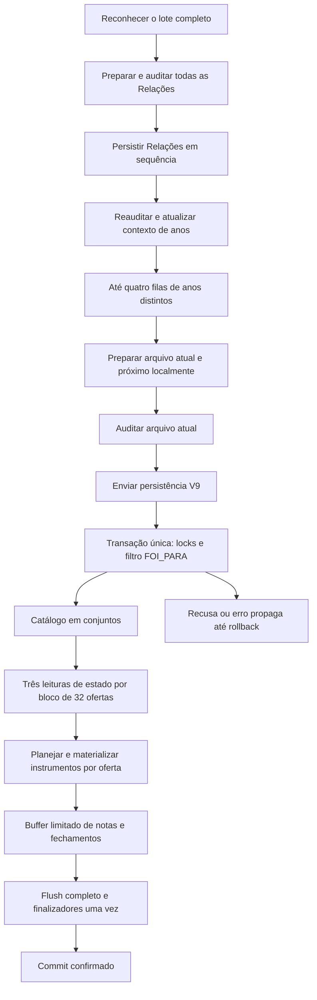

# Importação V11: integridade e desempenho (#1225)

Fonte de verdade: [issue #1225](https://github.com/mcpmieda/ecossistema-escola/issues/1225), anexos A–F, contratos V9 e decisões canônicas do Banco. Este documento registra implementação e evidência; não redefine regras acadêmicas.

## Escopo do release

F1–F6 compõem o release de código, sem alteração de transporte, schema, migrations, privilégios, provider ou política de publicação. O líder retirou expressamente **F7 deste release**: escopo individual da preparação do Portal depende de medição produtiva adequada e contrato próprio aprovado. O conjunto conservador de alunos, mudanças globais e finalizadores vigentes continua sendo utilizado. F7 não está concluída.

A correção F1 tem PR separado. Os commits de F2, F5, F3/F4 e F6 permanecem identificáveis por fase; a integração coordenada das otimizações usará um único PR final. Essa organização reduz estados intermediários e concentra a verificação completa sobre a composição final. Instrumentos e limites do buffer são publicados juntos.

## Fluxo implementado



Nenhuma Auditoria nem persistência acadêmica do próximo arquivo é antecipada. Dentro de cada fila de ano existe no máximo uma operação remota ativa. A concorrência local não substitui os locks do servidor nem protege outras abas. Todas as Relações passam pela barreira global antes de qualquer docente.

## Responsabilidades e limites

- `import-relational-service-v10.ts`: recusa tipada atravessa o limite transacional externo; resposta original é devolvida após rollback. Exceções inesperadas continuam sendo propagadas.
- `relational-import-read-set-v11.ts`: resolução de catálogo usando normalização SQL `lower(btrim(...))`, associação por identidade/sourceIndex, três leituras de instrumentos/notas/fechamentos por bloco. Inclui todas as observações persistidas, inclusive nulas e de alunos fora do trecho enviado.
- `import-relational-instrument-plan-v11.ts`: plano por oferta reutiliza os helpers decisórios V9. `relational-import-instrument-batch-v11.ts` materializa retiradas filho→pai, criações e alterações antes das notas; valida contagens e todas as chaves retornadas.
- `json-record-chunks-v1.ts`: helper comum F4/F5. Cada registro JSON é serializado uma vez; cada grupo é montado a partir dos registros, com contabilidade UTF-8 incluindo colchetes e vírgulas.
- `relational-import-write-buffer-v11.ts`: grupo SQL de até **512 registros / 256 KiB**; pendências somadas entre as sete categorias de até **2.048 registros / 1 MiB JSON**. Ordem: exclusão/alteração/criação de nota; histórico/exclusão/alteração/criação de fechamento. Dependência sobre a mesma chave força flush prévio. Falha invalida a instância; não há repetição de grupos parcialmente executados. Uma nova tentativa exige nova transação.
- `use-import-batch.ts`: até **4 filas de anos**, com **atual + próximo** por fila, máximo **8 estruturas docentes preparadas**. Esse limite não conta os resultados reconhecidos mantidos para a interface. Todas as Relações são preparadas para a barreira global, limitadas pelo lote já aceito; sua quantidade é medida separadamente e liberada conforme termina.

Os limites são internos, não novos limites de arquivo/população. Um pedido válido maior percorre vários blocos/grupos sob a mesma transação. O teto JSON pendente não representa limite de heap: requests, readsets, diagnósticos da interface e strings têm custo adicional.

Compatibilidade: grafias SQL equivalentes com rótulos diferentes de disciplina usam o resolvedor sequencial vigente quando necessário; preserve-se a ordem e contagem de mudanças globais. Se a mesma oferta SQL aparece em posições diferentes, os mapas são atualizados em sequência. Instrumentos são agrupados **por oferta**, não integralmente por bloco. Leituras legítimas de ledger e fronteiras de metadados ainda podem descarregar o buffer.

## Métricas e fronteiras

O observador é criado por requisição autorizada, abaixo do buffer. Ele preserva receiver, transações aninhadas, `lastFailure` e fechamento do adaptador. Só registra agregados e categorias fixas: não retém parâmetros, resultados, SQL bruto, nomes, identificadores individuais, hashes de arquivos ou valores acadêmicos.

| Medida                                                                                             | Fronteira / interpretação                                                                                                                                                                                                                                                                           |
| -------------------------------------------------------------------------------------------------- | --------------------------------------------------------------------------------------------------------------------------------------------------------------------------------------------------------------------------------------------------------------------------------------------------- |
| `handlerMs`, header `X-Gradebook-Server-Ms`                                                        | Handler autorizado, preservando significado anterior; não inclui necessariamente encerramento do adaptador.                                                                                                                                                                                         |
| `requestLifecycleMs`                                                                               | Entrada da rota até conclusão do wrapper, incluindo encerramento do recurso.                                                                                                                                                                                                                        |
| `transactionMs`, `transactionOutcome`                                                              | Transação externa; `rejected` não certifica fisicamente rollback e `unknown` distingue falha após callback completo. Testes reais certificam rollback.                                                                                                                                              |
| `sqlCalls`, `sqlReadCalls`, `sqlWriteCalls`, `sqlFailedCalls`, `rowsRead`                          | Chamadas físicas, abaixo do buffer; uma delegação `query`→`executeNative` não é contada duas vezes.                                                                                                                                                                                                 |
| `coordinationCallMs`, `finalizerMs`                                                                | Tempo das chamadas de coordenação; tempo completo dos callbacks finalizadores. Não representam exclusivamente espera de lock ou CPU de SQL.                                                                                                                                                         |
| `readSetBlocks`, `readSetOffers`, `maximumReadSetOffers`, `maximumReadSetRows`                     | Blocos executados, ofertas carregadas e maior soma de linhas dos três conjuntos do bloco. Não medem bytes do heap.                                                                                                                                                                                  |
| `catalogReadCalls`, `catalogWriteCalls`, `instrumentsCreated/Updated/Retired`                      | Catálogo e instrumentos identificados por marcadores SQL fixos; contagens físicas de linhas.                                                                                                                                                                                                        |
| `groupedStatements*`, `groupCounts`, `maximumGroupRows/Bytes`                                      | Grupos de notas/fechamentos tentados, concluídos ou falhos; tamanho real emitido. Grupos de instrumentos têm medidas separadas.                                                                                                                                                                     |
| `bufferedLogicalMutations`, `flushesWithWork`, `flushReasonCounts`, `maximumPendingRows/JsonBytes` | Entradas lógicas e descargas efetivas. Razões: leitura, write não bufferizado, fim de transação, dependência, linhas ou bytes. Flush vazio não é contado.                                                                                                                                           |
| Browser `diagnosticLocalMs`, `canonicalBuildMs`, `auditRequestMs`, `preparationElapsedMs`          | Preparação local, construção canônica e HTTP de Auditoria separados. `version: 2` e `totalMs` anteriores preservam o recorte preparação + Auditoria; `preparationElapsedMs` inclui retenção/espera até o fim da Auditoria. A fase de Auditoria distingue observação inicial e follow-up da Relação. |
| Browser `queueWaitMs`, `persistRequestMs`, `payloadBytes`                                          | Fila após preparação, excluindo Auditoria; fetch até leitura/validação da resposta; bytes UTF-8 do corpo enviado. Ausência de header é `null`, não zero.                                                                                                                                            |
| Browser `firstPersistenceStartedMs`, `firstConfirmedPersistenceMs`, `batchElapsedMs`               | Primeiro POST efetivamente despachado, primeira confirmação aplicada/idêntica e lote completo. Recusa/erro incerto não conta como confirmação.                                                                                                                                                      |
| Browser `maximumPreparedTeacherItems/Relations`, `maximumActiveYearLanes`                          | Picos de estruturas canônicas locais e filas ativas; não estimam heap total ou throughput sustentado.                                                                                                                                                                                               |

Falha de logging opcional não altera a resposta acadêmica. As métricas permanecem agregadas também em recusas; status, tempo e contador não identificam aluno.

## Evidência de desempenho

Ambiente descartável: Node 24.19.0, PGlite 0.5.8, mesma sessão cloud, migrations existentes de gradebook e fixtures existentes do Portal (incluindo revisão/outbox). São 15 ofertas, 30 vínculos inventados, 4 instrumentos × 3 trimestres e 360 notas observadas, incluindo nulos. Três repetições com banco novo para cada sequência; nenhuma conexão nem carga artificial sobre produção.

Comparação reproduzível: fonte baseline `fe985de6c95936408cd9d8b0b2065241abfc109d` em checkout isolado, copiando apenas o teste de medição; fonte backend candidata `cbe3269b` com o mesmo teste, antes das mudanças de fila (que não participam desse ensaio servidor). São versões de fonte identificáveis, não evidência de CI/publicação. Os hashes de fatos e contagens de referência também coincidiram com a baseline inicial medida em `a7cd3868` mais árvore F2, posteriormente commitada em `fe985de6`.

Cada cenário preservou o mesmo digest dos fatos sintéticos (notas, instrumentos, fechamentos e contadores de revisão), em todas as três repetições, e o mesmo resumo lógico de writes. A igualdade não ignora nulos/zeros nem contadores; apenas metadados técnicos de geração não entram na seleção. O teste reproduzível protege esses resultados de referência.

| Cenário                              | SQL antes → depois | Leituras antes → depois | Flushes antes → depois | Mediana ms antes → depois (n=3) | Máximo grupo notas/fechamento, registros / bytes depois | Fatos e resumo iguais? |
| ------------------------------------ | ------------------ | ----------------------- | ---------------------- | ------------------------------- | ------------------------------------------------------- | ---------------------- |
| Primeira carga / 15 ofertas          | 495 → 81           | 80 → 10                 | 195 → 16               | 283.61 → 107.8                  | 24 / 1201                                               | Sim                    |
| Reimportação idêntica / 15 ofertas   | 86 → 16            | 80 → 10                 | 0 → 0                  | 39.66 → 14.12                   | 0 / 0                                                   | Sim                    |
| Uma nota alterada                    | 88 → 18            | 80 → 10                 | 1 → 1                  | 50.22 → 23.22                   | 1 / 48                                                  | Sim                    |
| Um metadado alterado                 | 88 → 18            | 80 → 10                 | 0 → 0                  | 53.51 → 25                      | 0 / 0                                                   | Sim                    |
| Qualitativo indisponível             | 86 → 16            | 80 → 10                 | 0 → 0                  | 37.92 → 15.38                   | 0 / 0                                                   | Sim                    |
| Retirada autoritativa de qualitativo | 93 → 19            | 80 → 10                 | 0 → 0                  | 50.19 → 24.97                   | 0 / 0                                                   | Sim                    |

Tempo individual antes/depois, por cenário e repetição:

- `M01-first-15-offers`: [305.61, 260, 283.61] → [128.38, 107.8, 101.39] ms.
- `M02-identical-15-offers`: [44.66, 39.66, 38.05] → [17.51, 14.12, 13.43] ms.
- `M03-one-mark`: [50.22, 45.62, 50.84] → [23.68, 23.22, 21.23] ms.
- `M04-instrument-metadata`: [53.51, 46.53, 55.56] → [25.58, 25, 23.79] ms.
- `M05-unavailable-preserves`: [37.92, 36.81, 39.7] → [15.38, 13.44, 15.48] ms.
- `M05-authoritative-remove`: [53.13, 49.97, 50.19] → [27.66, 23.12, 24.97] ms.

Na primeira carga, grupos de notas/fechamentos caíram de 210 para 45, writes SQL de 409 para 65 e flushes de 195 para 16. Uma nota ou um metadado alterado continua contando um write lógico; retirada de três instrumentos com seis notas conta nove linhas, embora execute menos statements. Reimportação idêntica e origem indisponível permanecem sem DML/revisão extra.

A redução estrutural é demonstrada; a mediana da primeira carga sintética caiu aproximadamente 62%. Com n=3, não se calcula p95 nem se promete SLA, ganho Hyperdrive ou capacidade produtiva. PGlite/WASM e aquecimento do runner não representam latência de rede/Cloudflare/PostgreSQL remoto. O custo de preparação do Portal real continua sem medição suficiente para autorizar F7.

Fila: comparação determinística `fe985de6` → candidata, 18 docentes do mesmo ano, n=1 por versão, custos injetados iguais de 3ms local/80ms Auditoria/5ms persistência: primeiro POST **1.494 → 83ms**, primeira confirmação **1.499 → 88ms**, lote **1.584 → 1.584ms**, pico preparado **18 → 2**, 18 confirmações na mesma ordem. O lote sequencial do mesmo ano conserva seu custo remoto; o primeiro arquivo não aguarda toda a preparação/Auditoria. Esses números são relógio de teste controlado, não latência observada de navegador/rede. O caso `reports a comparable 18-file...` em `bounded-import-queue.test.ts` reproduz a experiência.

Testes de promises controladas/fake timers também demonstram o primeiro POST sem aguardar todos os docentes, quatro anos ativos, uma operação remota por ano e máximo oito estruturas preparadas. Isso comprova sobreposição e limites, sem alegar mediana produtiva de lote.

## Verificação e operação

```sh
npx vitest run tests/gradebook/import/relational-import-atomicity-v11.test.ts tests/gradebook/import/relational-import-read-set-v11.test.ts tests/gradebook/import/relational-import-instrument-plan-v11.test.ts tests/gradebook/import/relational-import-write-buffer-v11.test.ts tests/gradebook/import/import-performance-observer-v1.test.ts tests/gradebook/import/bounded-import-queue.test.ts tests/gradebook/import/import-diagnostics-current-state-v1.test.ts
BENCHMARK_REPETITIONS_V11=3 BENCHMARK_REPORT_PATH_V11=/tmp/import-performance-v11.json npx vitest run tests/gradebook/import/relational-import-performance-v11.test.ts
npm run verify
npm run test:student-portal-postgres
```

Para a comparação histórica, copiar somente o mesmo teste para o checkout `fe985de6` e executar com `BENCHMARK_PROFILE_V11=baseline`; esse perfil mantém os seis asserts semânticos e de idempotência, apenas omite os limites estruturais próprios da implementação nova. Nenhum tempo absoluto é gate de aceitação. A execução comum do CI exercita todos os cenários em uma repetição.

PostgreSQL nativo exige o ambiente descartável e configurações vigentes das suítes; não se utiliza produção. A prova nativa F1 compara tabelas gradebook/Portal após recusas, incluindo writes físicos anteriores. PGlite adicional comprova recusa lógica, SQL23505 real/injetado, cardinalidade, falha inesperada, segundo chunk e finalizador; novos testes de conjuntos cobrem 33 ofertas, retorno invertido, observações nulas fora do trecho, REC N/C/R/R e idempotência.

O primeiro CI F1 encontrou mock V9 sem retorno e outro com estado legado inexistente `persisted` em `misc-native-reads-v1.test.ts`. A fixture passou a devolver `no-changes` e o teste verifica a mesma resposta; nenhuma regra de produção nem gate foi relaxado. Uma execução nativa oscilou no p95 de login (1.589ms para limite1.500ms, fora da importação alterada); reexecução do mesmo head passou sem mudar teste ou limite.

Diagnóstico prático: comparar SQL/flushes/tamanho com `transactionMs`, `handlerMs`, lifecycle e HTTP. Muito tempo de lifecycle após handler pede investigação de encerramento, sem alterar pool nesta entrega. Erro de rede/503 da persistência significa confirmação incerta: parar novos despachos, drenar os já iniciados e retomar só pendentes na mesma aba. Recibos confirmados permanecem confirmados mesmo quando uma re-Auditoria falha. Auditoria tem resultado independente, incluindo observação vazia `[]`; uma gravação acadêmica não limpa diagnósticos por conta própria.

Uso real posterior: responsável escolhe lote/momento. Conferir confirmação, resumo/Auditoria, reimportação idêntica e resultado do Portal. Comparar os agregados disponíveis sem copiar arquivos, valores ou IDs para repositório público. Monitor existente cobre saúde/telemetria parcial; não certifica importações autenticadas nem banco profundo.

Reversão: interromper novos despachos se houver regressão, preservar recibos/estado incerto e usar PR + gates + deploy oficial para corrigir/reverter as otimizações. **Manter a proteção F1**; voltar ao rollback vulnerável não é estado final aceitável. Nenhuma migration foi criada/aplicada, nenhuma reconstrução ou reset produtivo faz parte dessa reversão.

## Prestação de contas F0–F9

| Fase | Estado neste checkpoint                 | Evidência / pendência                                                                                                                                            |
| ---- | --------------------------------------- | ---------------------------------------------------------------------------------------------------------------------------------------------------------------- |
| F0   | Concluída                               | Baseline main `5faaab56`, AGENTS, contratos e anexos A–F revalidados.                                                                                            |
| F1   | Integrada; publicação em acompanhamento | PR #1226 integrada em `443e6f2c`; CI `36959363295` e nativo `36959362896` aprovados no head `0867a76f`; deploy oficial `36960364498` iniciado.                   |
| F2   | Implementada                            | Commit `fe985de6`; observer e fronteiras de tempo, baseline válida e privacidade testada.                                                                        |
| F3   | Implementada                            | Commit `ed7fa55d`; catálogo em conjuntos e três leituras por bloco32.                                                                                            |
| F4   | Implementada                            | Mesmo commit; plano com helpersV9 e materialização limitada por oferta.                                                                                          |
| F5   | Implementada                            | Commit `a10545c4`; limites globais, chunks, dependências e instância inválida após falha.                                                                        |
| F6   | Implementada e revisada                 | Commit `2037d910`; fila, barreiras, lookahead e retomada; recibo confirmado preservado na re-Auditoria403 e follow-up sem novo POST acadêmico.                   |
| F7   | Retirada expressamente deste release    | Condicional; contrato/aprovação e medição próprios pendentes. Não implementada.                                                                                  |
| F8   | Em andamento                            | Revisão independente e ajuste F6 concluídos; 144 testes integrados, lint e todos os typechecks verdes. CI/gates completos da composição final ainda necessários. |
| F9   | Em andamento                            | Merge commit/deploy oficial e referências exatas a registrar na issue; uso real posterior pendente.                                                              |

Não confundir código implementado, gates aprovados, publicação concluída e uso real homologado. A issue permanece aberta enquanto a prestação de contas final não estiver registrada.
