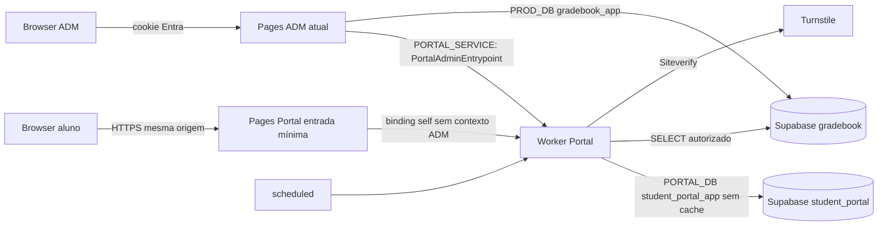

# Arquitetura e contratos V1

## Concorrência de contas — #782

`accountTransactionV1` usa global compartilhado(613,0) → ano compartilhado(613,2026) → revisão `FOR SHARE`; contas continuam `FOR UPDATE` antes de credenciais/sessões/jobs. Auth individual, sessão própria/Self (inclusive leitura aninhada), cron/reconciliação e execução/claim de jobs usam esse modo. `authTransactionV1` conserva o padrão exclusivo para demais operações. Escritores BN, políticas, reset e comandos administrativos continuam excluindo os consumidores. O adapter impede upgrade e escritas acadêmicas/de vínculo no modo compartilhado. Ver PA-DEC-008 e o delta em `docs/gradebook/YEAR_RESET_SETTINGS.md`; essa exceção substitui somente a exclusividade dos consumidores rotineiros no inventário histórico abaixo. Sem DDL, cache, retry cego ou mudança de autorização.

## Publicação manual e atualização automática — #1112

A primeira liberação de um período continua explícita: `autoUpdate` nunca publica um período que ainda não possui decisão de publicação. Depois da primeira liberação, `autoUpdate=true` seleciona imediatamente a revisão acadêmica mais recente preparada para aquele aluno/período, sem comando adicional, job ou polling da página. Ao desligar, a última revisão já aprovada fica congelada; uma revisão posterior aparece como `update-pending` e exige `publish-update`.

A UI espelha essa autoridade: `Publicar notas` existe apenas para a primeira publicação; `Atualizar notas publicadas` aparece somente quando `autoUpdate=false` e o servidor devolve `update-pending`; período já atual não oferece republicação redundante. O backend recusa `publish-update` sem pendência e `publish` redundante quando todos os alvos já estão publicados, protegendo contra aba obsoleta e corrida de política.

## Composição corrente — #757

Aluno: entrada própria consome e remove o fragmento de /access antes do React/widget; QR e senha ficam em memória transitória. StudentPortalShellV1 recebe children/onLogout; StudentPortalPageV1 recebe o estado Self e o slot grades, ambos da mesma resposta. Session precede me; expiração, saída e retorno do histórico limpam dados. Saída com falha mantém a tela protegida vazia e permite tentar a saída novamente. Cancelar/ocultar autenticação também descarta o QR na composição.

ADM: Painel do Aluno integra manifesto, rota, pesquisa e shell existentes, com platform.settings.read/write herdadas. /api/me fornece identityKey e expiresAt da mesma sessão Entra; esses campos só delimitam a vida da UI, sem conceder autoridade. Os oito módulos recebem clientes estáveis e scope 2026, independente do ano global BN. Troca/perda/expiração de identidade desmonta dados e artefatos privados; 401/403 das APIs invalida a composição. Ficha oferece slots sob demanda; colapsar um slot já aberto não interrompe autosave.

Accounts/overview/sessions usam leitura V2; comandos e demais consultas V1 permanecem. Cursor assinado delimita ator/operação/filtro/contrato/TTL, não substitui CAS. Validade de sessão usa política efetiva; contagem de revogações é observação e não lock. Publicação aceita não equivale a projeção já observada. Cada editor preserva intenção/idempotência e revisão; QR emitido entrega PNG privado, sem reemitir silenciosamente quando falha a renderização. IP de auditoria mantém retenção própria.

Topologia, origem, cookies, headers, roles SQL e bindings permanecem. O harness de composição usa os handlers Pages, Worker/RPC e PostgreSQL reais com massa exclusivamente inventada; selo Entra sintético e bootstrap SharePoint inventado são limites explícitos, nunca prova de autenticação institucional. Sem DDL, abertura, população, nascimento confirmado ou reset produtivo. #758/#759 recebem a validação integrada e o aceite real.

## Desenho histórico da preparação #743 (interfaces substituídas pela composição acima)

O backend existente e a topologia Pages aluno → PORTAL_SELF → Worker/PORTAL_DB e ADM Entra → PORTAL_SERVICE privado permanecem. #744 acrescenta build estudantil separado; #757 monta o produto. HTML/assets têm headers próprios, separados do JSON default-src none. A permissão de câmera pertence ao host aluno; ADM conserva camera=(). /access usa fragmento QR local, não o roteamento de hash do ADM. Nada de bundle Entra/SQL/BN no navegador estudantil, API administrativa pública ou binding produtivo em preview.

Interfaces de UI (somente composição, sem nova autoridade HTTP):

- Shell recebe `profile: SelfResponseV1['profile'] | null`, `content: ReactNode`, estado visual e `onLogout: () => Promise<void>`. Perfil e tabela vêm da mesma resposta/revisão; conteúdo é slot e domínio nunca importa React.
- Grades recebe `SelfResponseV1`, sem callback para recalcular nota/publicação; mapeia somente marks/officialOutcome autorizados. `no-publication` é distinto de erro/carregamento.
- Auth recebe cliente tipado e `onAuthenticated`; servidor escolhe credential-required/password-creation. Segredos/QR ficam em memória temporária, nunca storage; tracks/URLs de objetos são encerrados no ciclo da tela.
- Módulos ADM recebem `scope` do contrato, cliente e callbacks de composição. AccountId/classId são identidade; rótulo, posição e ano global BN não definem escopo. Ficha usa slots para nascimento/QR/sessões/publicação/auditoria.
- Cliente self separa `session`, `me`, `challenge`, `activate`, `login`, `logout`; ADM separa `query`/`command` e só envia schemas públicos. Contexto confiável Pages/tenant/capability/IP não é parâmetro da UI. #746 define a extensão compatível antes de #757 integrá-la.
- Estado de carregamento: idle/loading/ready/error; payload protegido só no ready do escopo corrente. Nova seleção aborta request anterior e incrementa geração; resposta atrasada não confirma edição nem devolve nota de outra conta. Logout/401 esvazia dados e exige sessão fresca ao retornar.
- Mutações mantêm idempotencyKey, versão e intenção enquanto retomam a mesma operação; conflito exige recarga/revisão, não troca silenciosa de versão. Birth-batch mostra resultados por item e retoma respeitando orçamento backend.

#744 implementa shared UI/clientes nesses limites; telas não editam essa fundação. #757 recebe ownership explicitamente. #745 contrato BN → #747 helper único/adapter; #746 contrato/queries ADM; testes e paths próprios por issue. Nenhum DDL nesta fila sem lacuna e escopo dedicados. [DAG e reservas](ISSUE_MAP.md).

## Delta integrado #703–#714 e composição publicada #715

A descrição original abaixo é o registro de desenho da #702, não inventário atual. Runtime, DNS, schema/ACL, KDF e módulos isolados foram implementados; inventário/evidência atual em PRODUCTION_READINESS e PROJECT_STATE. Locks ratificados: global compartilhado(613,0)→ano exclusivo(613,2026)→revisão→contas ordenadas; reset global exclusivo. Migrations0001–0007 aplicadas. API/DTOs complementares #732/CAS e #735/IP integram contratosV1.

A composição usa adapters HTTP já validados e conexões por invocação; métodos auth são lazy para validar bytes/schema e rate limit antes de SQL. Self lê sessão/projeção na mesma transação autorizada. Contexto ADM é criado da sessão Entra selada no Pages, transportado apenas pelo binding nomeado e revalidado no Worker. IP é metadata Cloudflare, nunca identidade; fonte em subrequest pode ser o Worker intermediário. SQL de toda operação ADM recebe contexto IP, inclusive configurações/publicação.

Cron e manutenção estão delimitados na prontidão e em server/student-portal/observability/OPERATIONS_V1.md. O gate externo não habilita população. Naquele checkpoint P1 ainda não havia interface P2; a composição corrente está descrita acima.

## Registro de arquitetura na fundação #702

Baseline auditada: ad38a7847eb49462818dca554e225155a57f49b4. Leitura fonte: server/auth/{roles,capabilities,session}.ts, functions/[[path]].ts, server/env.ts, wrangler.jsonc e workflows; BN import-relational-service-v9/v10/v11, relational-import-write-buffer-v11, relational-council-v3, year-reset-v1, relational-bulletin-v2 e projeções oficiais. Sem alteração desses arquivos em #702. Contrato acadêmico compartilhado é exclusivamente #703.

## Mapa e topologia

DNS autoritativo é GoDaddy; nenhum zone Cloudflare visível. Worker custom domain direto exige zona ativa. Escolha técnica PA-DEC-002: Pages mínimo somente como entrada HTTPS para manter aluno.escolaieda.com e backend Worker, com bindings self/admin distintos. Equivalência de segurança é contratada, prova de suporte/custo real permanece T-01/T-02/#705: não declarar domínio operacional sem ela. Não usar Pages ADM como host do aluno, CNAME para workers.dev, mudança de nameservers ou partial setup pago. Destino pages.dev ainda não existe; criar/associar primeiro, inserir CNAME real no Edge autorizado e encerrar automação depois, na #705.

Worker público/default expõe apenas rotas self e health; métodos admin não existem nele. Entrada Pages aluno tem somente binding self; Pages ADM tem PORTAL_SERVICE para entrypoint nomeado. Request original conserva URL/origin e cookie; rejeitar host inesperado, X-Forwarded/claims do cliente e preview produtivo. Chamadas RPC são awaitadas; service binding é capacidade de acesso, não dispensa validar contexto/escopo. Credenciais não passam por URLs de queries. HTTPS/TLS/origem/cookie/negativas precisam de smoke real em #705/#713/#715.

## HTTP/RPC

| Método/rota | Schema request → resposta | Autoridade |
|---|---|---|
| POST /api/student/auth/challenge | challengeRequestV1 → challengeResponseV1 | QR/HMAC+estado; PIN só ativação/reset; risco antes KDF |
| POST /api/student/auth/activate | activateRequestV1 → sessionResponseV1 | desafio único e versões válidas; cookie após commit |
| POST /api/student/auth/login | loginRequestV1 → sessionResponseV1 | QR+senha+política+eligibilidade fresca |
| POST /api/student/auth/logout | logoutRequestV1 → logoutResponseV1 | sessão própria/origem; idempotente |
| GET /api/student/session | sem body → sessionResponseV1 | sessão PG sem cache |
| GET /api/student/me | sem body → selfResponseV1 | projeção própria autorizada/revisões vigentes |
| GET /healthz | sem body → healthV1 | só estado, nunca inventário/DB/secrets |
| POST /api/student-portal/admin/query | adminQueryV1 → adminResponseV1 | Pages Entra platform.settings.read |
| POST /api/student-portal/admin/command | adminCommandV1 → adminResponseV1 | Pages Entra platform.settings.write |
| RPC PortalAdminEntrypoint.query/command | mesmos DTOs + TrustedAdminContextV1 | contexto exclusivo servidor Pages autenticado |

Sem endpoints GET mutantes. Falha usa failureV1 e ERROR_HTTP_V1. Resposta success genérica por operação deve ser verificada contra state permitido: query accounts→accounts, sessions→sessions, birth-years→birth-years, settings→settings, publication→publication, audit→audit, audit-detail→audit-detail, health→health, links-preview→links-preview. Comandos QR→qr; birth-batch→batch; demais→committed. Falha DB não é409, mas503. Credenciais inválidas compartilham401 genérico; só QR válido determina próximo passo sem identidade. Auth max8KiB; ADM64KiB antes parse; query cursor opaco estável escopado+expiração; limite1…100 default50. Unknown keys são rejeitadas, não silently stripped. Todos responses protegidos no-store; corpo/cookie não são logados.

Mutações CAS verificam expectedVersion agregado e item quando aplicável; idempotencyKey é escopada por ator/operação+digest canônico. Retry mesmo payload retorna referência de resultado comprometido, outro payload409. Retenção de recibos24h (técnica); tokens/senhas não entram no recibo. Perda de resposta de ativação não armazena token para replay: desafio consumido recusa reuso; novo login seguro gera sessão. Birth batch transação por item, item sem autorização recusado, sem lost update; outerVersion identifica revisão do lote/escopo. QR batch limitado100 e escopo/classe rechecados; resposta somente operador autorizado. Efeito imediato e encerramento exigem confirmação do escopo atual, não booleano sem preview/contagem.

## Estados e transações

| Evento | Conta/QR/senha | Sessão/desafio/vínculo |
|---|---|---|
| perfil novo | pending-activation, vínculo único2026 | sem sessão; nascimento ausente bloqueia ativação |
| ativação | active, mesmo QR, senha verifier | desafio consumido e sessão criada mesmo commit |
| reset senha | reset-required, QR igual, senha inválida | revoga sessões/desafios; vínculo intacto |
| regenerar QR | conta/senha iguais, QR anterior revogado | incrementa securityVersion/revoga sessões/desafios |
| reset conta | pending-activation, QR novo, senha inválida | revoga sessões/desafios; vínculo intacto |
| nascimento corrigido/limpo | mesmo estado/QR/senha | incrementa pinVersion/invalida desafios; sessão preservada |
| saída/bloqueio | elegibilidade exit ou blocked=true | revoga; retorno não restaura tokens antigos |
| troca turma | conta/QR/senha/nascimento iguais | política/projeção antigo escopo inválidas |
| links-close | histórico preservado, vínculo ativo null+tombstone | revoga acesso; perfil não repopula por importação |

Proposta de locks a ratificar exclusivamente #703: ordem ano→tabelas acadêmicas quando reset→contas em UUID ordenado→credenciais/sessões/jobs. Reusar advisory (613,ano) do importador no começo de todas transações de vínculo/reset; não adquirir em ordem inversa após table lock atual. Guards dentro da transação, com FK sem cascade e versão relevante de preview, não hash de contagens isolado. SQL plano/concorrência/multiconexão são #706/#707, não provados por interfaces TS.

## Modelo físico e slots de migration (autoria #704)

| Tabela student_portal | Campos/constraints mínimos e índices |
|---|---|
| account | UUID PK, academic_year=2026, gradebook_student_id nullable após fechamento, UNIQUE vínculo ativo, FK(id,ano) sem cascade, authState, eligibility, blocked, version/securityVersion/pinVersion, closedAt; índice vínculo e turma efetiva via BN |
| account_access_data | account FK única, birthYear nullable1900…2026, confirmation nullable/coerente, version; sem nome/nota/data completa |
| qr_credential | credentialId aleatório único, account FK, keyVersion, active/revoked/timestamps; único ativo parcial por conta; nunca payload completo |
| password_credential | account única, verifier PIN/senha nullable, salt/algoritmo/parâmetros/pepperVersion e versões; sem credenciais plaintext |
| session | UUID PK, tokenHash único, account/securityVersion, expires/revoked/persistent; índices hash, conta, expiração |
| setting | scope+field key única, valor validado e versão; índice escopo |
| publication | scope/período, revisão aprovada/disponível, estado e versão; chave única escopo/período |
| published_projection | conta/ano única, payload sanitizado e data/policy/publicationVersion, generatedAt; troca atômica |
| auth_attempt / auth_challenge | conta/credencial+janela/counter/bloqueio; tokenHash único, expires/consumed e security/pinVersion; índices expiry |
| publication_job | unique conta/revisões/ação, lease/estado/tentativas/nextAt; índice estado/nextAt |
| academic_revision / revision_event | revisão durável e evento idempotente na mesma transação de produtor BN; não readAt |
| audit_event | UUID/ator/escopo/tipo/resultado/correlação/versão/timestamp, IP restrito com expiry; índice data/conta/tipo |
| operation_receipt / link_closure | idempotência+digest sem secrets; tombstone/preview/escopo/versão para encerramento explícito preservando histórico |

Slots reservados:0001 schema/role/identidade/credenciais/ACL;0002 políticas/calendário/publicação/jobs/revisões;0003 auditoria/recibos/encerramento/índices de integração;0004 validação adicional aditiva se necessária. Somente #704 escreve migrations; #705 aplica. Nomes account_access_data/revision_event/link_closure substituem diretório externo obsoleto, com finalidade delimitada. DDL real final precisa satisfazer invariantes e ledger atual; nunca reaplicar migrations BN antigas. Role Portal sem DDL/BYPASSRLS/superuser, sem writeBN; leitura por views/colunas aprovadas em #703. gradebook_app só função estreita de integração com search_path fixo, sem DML geral de credenciais; PUBLIC/anon/authenticated sem acesso. Separar role DDL, secrets próprios e inventário de versões de chaves.

Fontes: [Pages DNS externo](https://developers.cloudflare.com/pages/configuration/custom-domains/), [Worker custom domains](https://developers.cloudflare.com/workers/configuration/routing/custom-domains/), [Pages bindings](https://developers.cloudflare.com/pages/functions/bindings/), [RPC](https://developers.cloudflare.com/workers/runtime-apis/bindings/service-bindings/rpc/). Provas operacionais pendentes na #705; essa documentação não comprova assinatura/custo.
