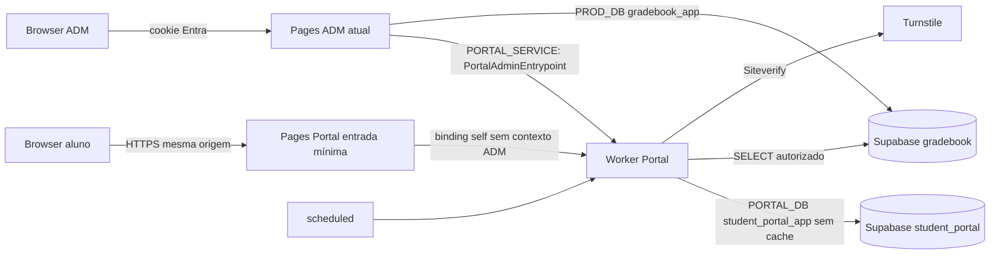

# Arquitetura e contratos V1

Baseline auditada: ad38a7847eb49462818dca554e225155a57f49b4. Leitura fonte: server/auth/{roles,capabilities,session}.ts, functions/[[path]].ts, server/env.ts, wrangler.jsonc e workflows; BN import-relational-service-v9/v10/v11, relational-import-write-buffer-v11, relational-council-v3, year-reset-v1, relational-bulletin-v2 e projeções oficiais. Sem alteração desses arquivos em #702. Contrato acadêmico compartilhado é exclusivamente #703.

## Mapa e topologia

DNS autoritativo é GoDaddy; nenhum zone Cloudflare visível. Worker custom domain direto exige zona ativa. Escolha técnica PA-DEC-002: Pages mínimo somente como entrada HTTPS para manter aluno.escolaieda.com e backend Worker, com bindings self/admin distintos. Equivalência de segurança é contratada, prova de suporte/custo real permanece T-01/T-02/#705: não declarar domínio operacional sem ela. Não usar Pages ADM como host do aluno, CNAME para workers.dev, mudança de nameservers ou partial setup pago. Destino pages.dev ainda não existe; criar/associar primeiro, inserir CNAME real no Edge autorizado e encerrar automação depois, na #705.

Worker público/default expõe apenas rotas self e health; métodos admin não existem nele. Entrada Pages aluno tem somente binding self; Pages ADM tem PORTAL_SERVICE para entrypoint nomeado. Request original conserva URL/origin e cookie; rejeitar host inesperado, X-Forwarded/claims do cliente e preview produtivo. Chamadas RPC são awaitadas; service binding é capacidade de acesso, não dispensa validar contexto/escopo. Credenciais não passam por URLs de queries. HTTPS/TLS/origem/cookie/negativas precisam de smoke real em #705/#713/#715.

## HTTP/RPC

| Método/rota | Schema request → resposta | Autoridade |
|---|---|---|
| POST /api/student/auth/challenge | challengeRequestV1 → challengeResponseV1 | QR/HMAC+estado; PIN só ativação/reset; risco antes KDF |
| POST /api/student/auth/activate | activateRequestV1 → sessionResponseV1 | desafio único e versões válidas; cookie após commit |
| POST /api/student/auth/login | loginRequestV1 → sessionResponseV1 | QR+senha+política+eligibilidade fresca |
| POST /api/student/auth/logout | logoutRequestV1 → logoutResponseV1 | sessão própria/origem; idempotente |
| GET /api/student/session | sem body → sessionResponseV1 | sessão PG sem cache |
| GET /api/student/me | sem body → selfResponseV1 | projeção própria autorizada/revisões vigentes |
| GET /healthz | sem body → healthV1 | só estado, nunca inventário/DB/secrets |
| POST /api/student-portal/admin/query | adminQueryV1 → adminResponseV1 | Pages Entra platform.settings.read |
| POST /api/student-portal/admin/command | adminCommandV1 → adminResponseV1 | Pages Entra platform.settings.write |
| RPC PortalAdminEntrypoint.query/command | mesmos DTOs + TrustedAdminContextV1 | contexto exclusivo servidor Pages autenticado |

Sem endpoints GET mutantes. Falha usa failureV1 e ERROR_HTTP_V1. Resposta success genérica por operação deve ser verificada contra state permitido: query accounts→accounts, sessions→sessions, birth-years→birth-years, settings→settings, publication→publication, audit→audit, audit-detail→audit-detail, health→health, links-preview→links-preview. Comandos QR→qr; birth-batch→batch; demais→committed. Falha DB não é409, mas503. Credenciais inválidas compartilham401 genérico; só QR válido determina próximo passo sem identidade. Auth max8KiB; ADM64KiB antes parse; query cursor opaco estável escopado+expiração; limite1…100 default50. Unknown keys são rejeitadas, não silently stripped. Todos responses protegidos no-store; corpo/cookie não são logados.

Mutações CAS verificam expectedVersion agregado e item quando aplicável; idempotencyKey é escopada por ator/operação+digest canônico. Retry mesmo payload retorna referência de resultado comprometido, outro payload409. Retenção de recibos24h (técnica); tokens/senhas não entram no recibo. Perda de resposta de ativação não armazena token para replay: desafio consumido recusa reuso; novo login seguro gera sessão. Birth batch transação por item, item sem autorização recusado, sem lost update; outerVersion identifica revisão do lote/escopo. QR batch limitado100 e escopo/classe rechecados; resposta somente operador autorizado. Efeito imediato e encerramento exigem confirmação do escopo atual, não booleano sem preview/contagem.

## Estados e transações

| Evento | Conta/QR/senha | Sessão/desafio/vínculo |
|---|---|---|
| perfil novo | pending-activation, vínculo único2026 | sem sessão; nascimento ausente bloqueia ativação |
| ativação | active, mesmo QR, senha verifier | desafio consumido e sessão criada mesmo commit |
| reset senha | reset-required, QR igual, senha inválida | revoga sessões/desafios; vínculo intacto |
| regenerar QR | conta/senha iguais, QR anterior revogado | incrementa securityVersion/revoga sessões/desafios |
| reset conta | pending-activation, QR novo, senha inválida | revoga sessões/desafios; vínculo intacto |
| nascimento corrigido/limpo | mesmo estado/QR/senha | incrementa pinVersion/invalida desafios; sessão preservada |
| saída/bloqueio | elegibilidade exit ou blocked=true | revoga; retorno não restaura tokens antigos |
| troca turma | conta/QR/senha/nascimento iguais | política/projeção antigo escopo inválidas |
| links-close | histórico preservado, vínculo ativo null+tombstone | revoga acesso; perfil não repopula por importação |

Proposta de locks a ratificar exclusivamente #703: ordem ano→tabelas acadêmicas quando reset→contas em UUID ordenado→credenciais/sessões/jobs. Reusar advisory (613,ano) do importador no começo de todas transações de vínculo/reset; não adquirir em ordem inversa após table lock atual. Guards dentro da transação, com FK sem cascade e versão relevante de preview, não hash de contagens isolado. SQL plano/concorrência/multiconexão são #706/#707, não provados por interfaces TS.

## Modelo físico e slots de migration (autoria #704)

| Tabela student_portal | Campos/constraints mínimos e índices |
|---|---|
| account | UUID PK, academic_year=2026, gradebook_student_id nullable após fechamento, UNIQUE vínculo ativo, FK(id,ano) sem cascade, authState, eligibility, blocked, version/securityVersion/pinVersion, closedAt; índice vínculo e turma efetiva via BN |
| account_access_data | account FK única, birthYear nullable1900…2026, confirmation nullable/coerente, version; sem nome/nota/data completa |
| qr_credential | credentialId aleatório único, account FK, keyVersion, active/revoked/timestamps; único ativo parcial por conta; nunca payload completo |
| password_credential | account única, verifier PIN/senha nullable, salt/algoritmo/parâmetros/pepperVersion e versões; sem credenciais plaintext |
| session | UUID PK, tokenHash único, account/securityVersion, expires/revoked/persistent; índices hash, conta, expiração |
| setting | scope+field key única, valor validado e versão; índice escopo |
| publication | scope/período, revisão aprovada/disponível, estado e versão; chave única escopo/período |
| published_projection | conta/ano única, payload sanitizado e data/policy/publicationVersion, generatedAt; troca atômica |
| auth_attempt / auth_challenge | conta/credencial+janela/counter/bloqueio; tokenHash único, expires/consumed e security/pinVersion; índices expiry |
| publication_job | unique conta/revisões/ação, lease/estado/tentativas/nextAt; índice estado/nextAt |
| academic_revision / revision_event | revisão durável e evento idempotente na mesma transação de produtor BN; não readAt |
| audit_event | UUID/ator/escopo/tipo/resultado/correlação/versão/timestamp, IP restrito com expiry; índice data/conta/tipo |
| operation_receipt / link_closure | idempotência+digest sem secrets; tombstone/preview/escopo/versão para encerramento explícito preservando histórico |

Slots reservados:0001 schema/role/identidade/credenciais/ACL;0002 políticas/calendário/publicação/jobs/revisões;0003 auditoria/recibos/encerramento/índices de integração;0004 validação adicional aditiva se necessária. Somente #704 escreve migrations; #705 aplica. Nomes account_access_data/revision_event/link_closure substituem diretório externo obsoleto, com finalidade delimitada. DDL real final precisa satisfazer invariantes e ledger atual; nunca reaplicar migrations BN antigas. Role Portal sem DDL/BYPASSRLS/superuser, sem writeBN; leitura por views/colunas aprovadas em #703. gradebook_app só função estreita de integração com search_path fixo, sem DML geral de credenciais; PUBLIC/anon/authenticated sem acesso. Separar role DDL, secrets próprios e inventário de versões de chaves.

Fontes: [Pages DNS externo](https://developers.cloudflare.com/pages/configuration/custom-domains/), [Worker custom domains](https://developers.cloudflare.com/workers/configuration/routing/custom-domains/), [Pages bindings](https://developers.cloudflare.com/pages/functions/bindings/), [RPC](https://developers.cloudflare.com/workers/runtime-apis/bindings/service-bindings/rpc/). Provas operacionais pendentes na #705; essa documentação não comprova assinatura/custo.
