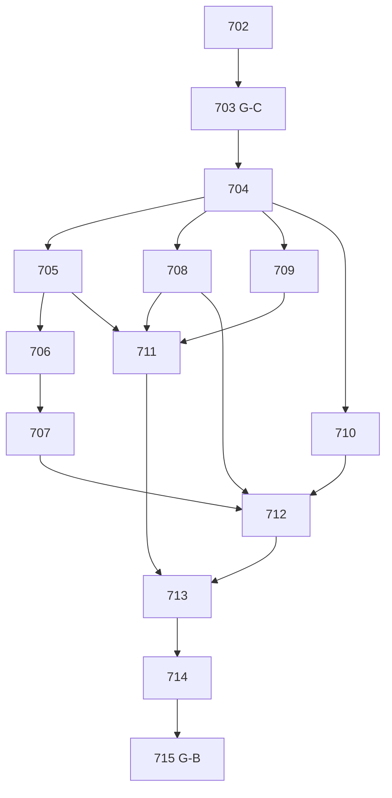

# Entregas P1, dependências e ownership

## Situação atual (13/09/2026)

#702–#714 integradas/publicadas, inclusive #732 e #735 para lacunas contratuais específicas. #715 é [AGORA][SEQUENCIAL][CODEX], execução direta. O quadro original abaixo é rastreio de planejamento: rótulos/executor históricos não substituem o estado atual no GitHub. Nenhuma P2 criada.

P1-01 contratos=#702/#703; P1-02 persistência/guarda=#704/#706; P1-03 runtime=#705; P1-04 perfis/políticas/nascimento=#707/#708/#709; P1-05 auth=#711; P1-06 fonte/publicação=#710/#712; P1-07 ADM=#713; P1-08 hardening=#714; P1-09 integração/aceite=#715. Autoria concluída não substitui os aceites remotos consolidados de I.

Mãe [#701](https://github.com/mcpmieda/ecossistema-escola/issues/701). Títulos abaixo identificam executor e paralelismo; consulta à issue confirma estado atual. Autoria, integração, DDL e prova real são etapas distintas. Nenhuma P2 nesta fila.

| Issue | Título | Predecessores de integração | Rastreio |
|---|---|---|---|
| [#702](https://github.com/mcpmieda/ecossistema-escola/issues/702) | [SEQUENCIAL][CODEX] [PA][P1] Contratos, decisões operacionais e ownership da fundação | G-V | P1-01 |
| [#703](https://github.com/mcpmieda/ecossistema-escola/issues/703) | [SEQUENCIAL][CHAT ONLINE] [BN][CONTRATO][PA][P1][INTEGRAÇÃO-BN] Leitura acadêmica, revisões e guarda do reset | #702 | P1-01 / P1-06 / reset A |
| [#704](https://github.com/mcpmieda/ecossistema-escola/issues/704) | [PARALELO][CHAT ONLINE] [PA][P1] Schema, ACL e persistência PostgreSQL nativa | #703 | P1-02 |
| [#705](https://github.com/mcpmieda/ecossistema-escola/issues/705) | [PARALELO][CODEX] [PA][P1] Runtime Cloudflare, DDL real e conexões isoladas | #704 | P1-03 / validação P1-02 |
| [#706](https://github.com/mcpmieda/ecossistema-escola/issues/706) | [PARALELO][CODEX] [PA][P1][INTEGRAÇÃO-BN] Impedir reset anual com contas vinculadas | #705 | Reset A / P1-02 / P1-09 |
| [#707](https://github.com/mcpmieda/ecossistema-escola/issues/707) | [PARALELO][CODEX] [PA][P1][INTEGRAÇÃO-BN] Sincronizar perfis e registrar revisões transacionais | #706 | P1-04 / P1-06 |
| [#708](https://github.com/mcpmieda/ecossistema-escola/issues/708) | [PARALELO][CHAT ONLINE] [PA][P1] Políticas herdadas, calendário e divulgação configurável | #704 | P1-05 |
| [#709](https://github.com/mcpmieda/ecossistema-escola/issues/709) | [PARALELO][CHAT ONLINE] [PA][P1] Cadastro de nascimento com CAS e invalidação atômica de desafios | #704 | P1-04 / P1-07 |
| [#710](https://github.com/mcpmieda/ecossistema-escola/issues/710) | [PARALELO][CHAT ONLINE] [PA][P1] Adaptador acadêmico oficial e projeção self mínima | #704 | P1-06 |
| [#711](https://github.com/mcpmieda/ecossistema-escola/issues/711) | [PARALELO][CODEX] [PA][P1] Autenticação, QR, KDF e sessões revogáveis | #705, #708, #709 | P1-04 / P1-08 |
| [#712](https://github.com/mcpmieda/ecossistema-escola/issues/712) | [PARALELO][CHAT ONLINE] [PA][P1] Publicação versionada e jobs duráveis recuperáveis | #708, #710, #707 | P1-06 |
| [#713](https://github.com/mcpmieda/ecossistema-escola/issues/713) | [SEQUENCIAL][CHAT ONLINE] [PA][P1] API administrativa privada e operações em lote | #711, #712 | P1-07 |
| [#714](https://github.com/mcpmieda/ecossistema-escola/issues/714) | [SEQUENCIAL][CODEX] [PA][P1] Hardening, observabilidade, carga e recuperação técnica | #713 | P1-08 |
| [#715](https://github.com/mcpmieda/ecossistema-escola/issues/715) | [SEQUENCIAL][CODEX] [PA][P1] Integração final, smoke 6A e gate G-B | #714 | P1-09 |

Primeira onda: após G-C, D e preparação R simultâneas (R só fecha após DDL D). Depois D, P/N/L no CHAT ONLINE enquanto CODEX configura R; A desenha crypto. Depois guarda G publicada, S integra/popula; A/S/L separados. U consome S/P/L. M após A/U; H harness sem wiringprod antesI, depois I compõe/deploya. Não existe dependência reversa R→D para fechar autoria D: workflow teste pode ser preparado por R antes de fechar runtime. N usa CryptoPort congelado, não depende da autoria A. Isso evita ciclos.

## Reserva exclusiva

| Owner | Paths |
|---|---|
| #702 | docs/student-portal/{README.md,MASTER_SPEC.md,ARCHITECTURE.md,DECISIONS.md,ISSUE_MAP.md,PROJECT_STATE.yaml,TEST_MATRIX.md,PRODUCTION_READINESS.md}; shared/student-portal-contracts/**; tests/student-portal/contracts/** |
| #703 | shared/gradebook-contracts/student-portal/**; shared/gradebook-contracts/settings/year-reset-contract-v1.ts; docs/gradebook/{CONTRACTS.md,CONSUMER_MAP.md,YEAR_RESET_SETTINGS.md}; tests/student-portal/bn-contract/** |
| #704 | migrations/student-portal/**; server/student-portal/persistence/**; tests/student-portal/persistence/** |
| #705 | workers/student-portal/**; wrangler.student-portal.jsonc; wrangler.student-portal-edge.jsonc (somente se alternativa Pages validada); package.json; package-lock.json; tsconfig*.json; worker-configuration.d.ts; wrangler.jsonc; .github/workflows/{validate-pull-request.yml,deploy-cloudflare-pages.yml,deploy-student-portal.yml}; server/env.ts; server/student-portal/runtime/**; tests/student-portal/runtime/** |
| #706 | server/gradebook/application/settings/year-reset-v1.ts; server/gradebook/http/year-reset-routes-v1.ts; src/features/gradebook/settings/gradebook-settings-page-v1.tsx; src/features/gradebook/settings/year-reset-client-v1.ts; server/student-portal/integration/year-reset/**; tests/student-portal/year-reset/**; testes existentes de year-reset afetados |
| #707 | server/student-portal/integration/lifecycle/**; server/student-portal/integration/revisions/**; server/gradebook/application/import/import-relational-service-v9.ts; server/gradebook/application/import/import-relational-service-v10.ts; server/gradebook/application/import/import-relational-service-v11.ts; server/gradebook/persistence/postgres/relational-import-write-buffer-v11.ts; server/gradebook/application/council/relational-council-v3.ts (decisões/fechamentos; mutações adicionais exigem ajuste nominal em B); tests/student-portal/lifecycle/**; tests/student-portal/revisions/** |
| #708 | server/student-portal/policies/**; tests/student-portal/policies/** |
| #709 | server/student-portal/birth-year/**; tests/student-portal/birth-year/** |
| #710 | server/student-portal/academic/**; tests/student-portal/academic/** |
| #711 | server/student-portal/auth/**; server/student-portal/crypto/**; server/student-portal/http/auth/**; tests/student-portal/auth/**; tests/student-portal/crypto/** |
| #712 | server/student-portal/publication/**; server/student-portal/jobs/**; tests/student-portal/publication/**; tests/student-portal/jobs/** |
| #713 | server/student-portal/admin/**; server/student-portal/http/admin/**; server/student-portal/admin-client/**; tests/student-portal/admin/** |
| #714 | server/student-portal/observability/**; server/student-portal/maintenance/**; tests/student-portal/security/**; tests/student-portal/integration/**; tests/student-portal/load/**; tests/student-portal/recovery/** |
| #715 | functions/[[path]].ts; workers/student-portal/**; server/student-portal/composition/**; server/env.ts; worker-configuration.d.ts; wrangler*.jsonc; package.json; package-lock.json; tsconfig*.json; .github/workflows/{validate-pull-request.yml,deploy-cloudflare-pages.yml,deploy-student-portal.yml}; docs/student-portal/{README.md,MASTER_SPEC.md,ARCHITECTURE.md,DECISIONS.md,ISSUE_MAP.md,PROJECT_STATE.yaml,TEST_MATRIX.md,PRODUCTION_READINESS.md}; docs/gradebook/PROJECT_STATE.yaml (somente status/links da integração); tests/student-portal/smoke/** |

Migrations D únicas; R aplica. Package/lock/tsconfig/wrangler/workflows/runtime R→I somente após handoff; roteador functions/[[path]].ts exclusivo I. Contratos C/B não são editados por consumidores: propor delta. Documentos centrais C→I; demais entregam evidência no handoff. Os paths de S adicionais devem ser nomeados em #703; não há wildcard livre BN. Na baseline, produtores observados: import-relational-service-v9/v10/v11, relational-import-write-buffer-v11, relational-council-v3. GuardaG e hooksS não disputam locks/test DB em paralelo. DDL/deploy/carga/importação/teste 6A requerem janela exclusiva ou ambientes/contas isolados. Sem subagentes/orquestrador.
